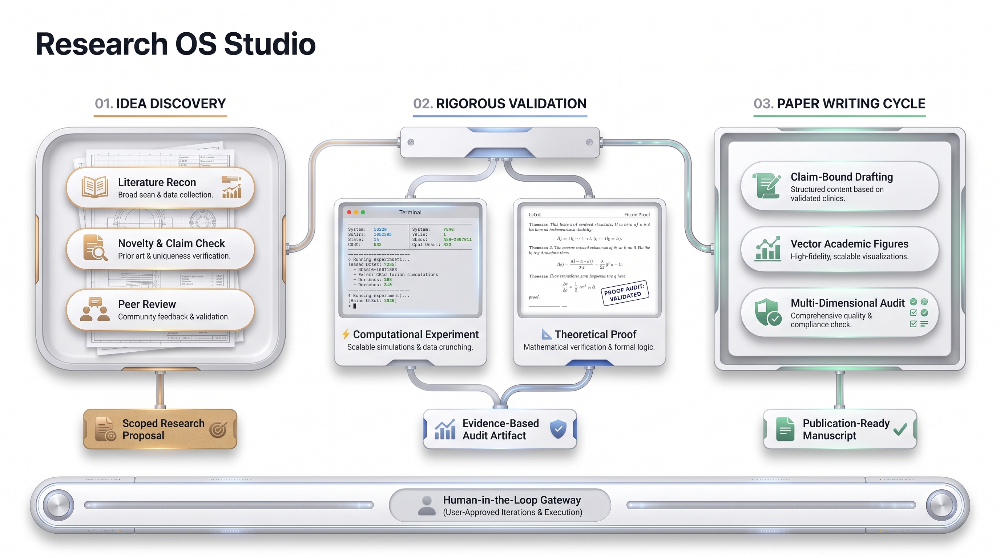

<div align="center">
  <picture>
    <source media="(prefers-color-scheme: dark)" srcset="docs/assets/logo-ondark.png">
    <source media="(prefers-color-scheme: light)" srcset="docs/assets/logo-onlight.png">
    
  </picture>

  <p>面向科研工作流的 Agent Skills 套件</p>

  <p>
    <a href="https://opensource.org/licenses/MIT"></a>
    <a href="skills/README.md"></a>
    <a href="docs/user-acceptance-guide.md"></a>
    <a href="https://github.com/toRolex/Research-OS-Studio/stargazers"></a>
  </p>

  <p>
    <a href="#english-version">English</a> · <a href="#research-os-studio">中文说明</a>
  </p>
</div>

---

## 架构与工作流

<div align="center">
  <picture>
    <source media="(prefers-color-scheme: dark)" srcset="docs/assets/workflow-dark.png">
    <source media="(prefers-color-scheme: light)" srcset="docs/assets/workflow-light.jpg">
    
  </picture>
</div>

---

## English Version

Research OS Studio is an Agent Skills suite designed for research workflows. It integrates into your research workspace, breaking work into clear stages: idea discovery, experimental validation, and paper writing. The AI assists within explicit authorization boundaries, keeping key judgments and final decisions with the researcher.

[View full English documentation →](docs/README-en.md)

---

## Research OS Studio

Research OS Studio 将科研过程拆解为边界明确的工作流。AI 在单次授权范围内生成候选方案、代码与草稿，实验设计、结果验收与推进决策由你把控。

## 目录

- [核心设计原则](#核心设计原则)
- [快速开始](#快速开始)
- [典型科研流程](#典型科研流程)
- [39 个 Skill 能力清单](#39-个-skill-能力清单)
- [安全与控制原则](#安全与控制原则)
- [常见问题](#常见问题)
- [相关文档](#相关文档)
- [开源协议](#开源协议)

---

## 核心设计原则

- **纯 Agent Skills**：无需安装独立 CLI、Python 包或后台服务，安装即用。
- **三大科研阶段**：
  1. **Idea Cycle（构思与查新）**：文���检索、多视角构思、新颖性核查、独立评审与方案收敛。
  2. **Validation Cycle（实验与理论验证）**：实证路径管理实验计划、执行监控、统计分析与审计；理论路径负责推导记录、证明起草、审查与修复。
  3. **Writing Cycle（论文写作与打磨）**：正文起草、学术绘图、LaTeX 编译检查、引用与结论一致性审计、审稿回复及转投适配。
- **人在回路**：顶层工作流完成后立即停止，绝不自动跳转到下一阶段（例如查新完成后不会擅自开始跑实验）。
- **原生文件格式**：成果直接以 Markdown、LaTeX、脚本和数据文件交付。

---

## 快速开始

### 1. 安装 Skills

在科研项目根目录下执行：

```bash
# 查看所有可用技能
npx skills@latest add toRolex/Research-OS-Studio --list

# 安装全部技能到当前项目
npx skills@latest add toRolex/Research-OS-Studio --all
```

### 2. 初始化工作区

安装后，在 Agent 中运行初始化命令：

```bash
/setup-research-os
```

该命令会检查现有目录结构并提供配置建议。所有改动在写入前都会展示完整草稿供你确认，不会覆盖已有研究资料，也不会擅自安装系统环境。

### 3. 选择技能

如果你不确定当前阶段该用哪个技能，可以直接询问路由助手：

```bash
/ask-research-os
```

它会根据你的研究方向或已有材料推荐最合适的技能。该助手只读咨询，不修改文件，也不自动触发任何工作流。如果你已经清楚目标，也可以直接输入对应技能名称调用。

---

## 典型科研流程

### 1. 构思与立项（Idea Discovery）
```text
输入研究方向
      ↓
/idea-discovery
  ├─ 检索文献并标注出处 (research-lit)
  ├─ 多视角生成方案 (idea-generation & creative-thinking)
  ├─ 检索已知工作并精准查新 (novelty-check)
  ├─ 独立评审与挑刺 (idea-review)
  └─ 方案细化与收敛 (idea-refinement)
      ↓
交付 RESEARCH_PROPOSAL.md（停止，等待用户决策）
```

### 2. 实验与推导（Validation）
```text
固定研究假设或待证命题
      ↓
实证路线                             理论路线
/experiment-plan                    formula-derivation（公式推导）
      ↓                                   ↓
/experiment-bridge                  proof-writer（起草证明）
  ├─ 代码试跑与资源监控                   ↓
  ├─ 训练异常诊断与干预建议          proof-review（逻辑与反例审查）
  └─ 独立审计代码与结果真实性             ↓
      ↓                             /proof-repair（有界修复）
/result-to-claim（提取约束结论）          ↓
      ↓                             /proof-orchestrator（长定理与 Lean 辅助）
交付实验审计与 Claim 报告（停止）    交付完整证明记录（停止）
```

### 3. 论文写作与审计（Writing Cycle）
```text
输入实验数据或理论成果
      ↓
论文起草与制作
  ├─ 通用论文：/paper-writing
  ├─ 机器学习：/ml-paper-writing
  └─ 系统方向：/systems-paper-writing
      ↓
专项审计与真实编译
  ├─ LaTeX 编译检查与修复 (paper-compile / /paper-compile-repair)
  ├─ 引用真实性核对与更新 (citation-audit / /apply-citation-fixes)
  ├─ 全文数据一致性校验 (paper-claim-audit)
  └─ 同行评审压力测试 (claim-stress-test)
      ↓
投后管理与衍生
  ├─ 审稿回复：/rebuttal
  ├─ 转投适配：/resubmit-pipeline
  └─ 学术演讲：/paper-talk
      ↓
交付论文草稿与配套材料（停止）
```

---

## 39 个 Skill 能力清单

全套包含 39 个独立技能。根据触发机制分为两类：
- **用户显式调用（User, 17 个）**：顶层工作流或管理入口，由用户主动发起。
- **模型内部调用（Model, 22 个）**：在顶层工作流中按需调用，也可以单独作为单项工具使用。

| 分类 | 技能名称 | 调用方式 | 说明 |
|---|---|---|---|
| **General** | [setup-research-os](skills/general/setup-research-os/SKILL.md) | User | 对话式初始化科研工作区与配置，需确认后写入 |
| | [ask-research-os](skills/general/ask-research-os/SKILL.md) | User | 只读导航助手，推荐当前阶段适用的技能 |
| **Idea Cycle** | [idea-discovery](skills/idea-cycle/idea-discovery/SKILL.md) | User | 构思查新工作流：文献检索、生成方案、查新、评审并输出 Proposal |
| | [research-lit](skills/idea-cycle/research-lit/SKILL.md) | Model | 文献检索与综合，标注出处与核实状态 |
| | [idea-generation](skills/idea-cycle/idea-generation/SKILL.md) | Model | 多视角生成研究候选方案，记录筛选理由 |
| | [creative-thinking-for-research](skills/idea-cycle/creative-thinking-for-research/SKILL.md) | Model | 构思瓶颈时的认知转换与正交发散 |
| | [novelty-check](skills/idea-cycle/novelty-check/SKILL.md) | Model | 检索已知工作，核对方案新颖性 |
| | [idea-review](skills/idea-cycle/idea-review/SKILL.md) | Model | 独立评审视角，指出方案弱点与潜在问题 |
| | [idea-refinement](skills/idea-cycle/idea-refinement/SKILL.md) | Model | 细化研究方案，输出最小可行路线与拓展路线 |
| **Validation** | [experiment-plan](skills/validation-cycle/experiment-plan/SKILL.md) | User | 制定包含假设、基线、指标与预算的实验计划 |
| | [experiment-bridge](skills/validation-cycle/experiment-bridge/SKILL.md) | User | 实验执行工作流：实现、试跑、监控、分析与审计 |
| | [run-experiment](skills/validation-cycle/run-experiment/SKILL.md) | Model | 在指定范围内执行实验代码并记录运行状态 |
| | [experiment-queue](skills/validation-cycle/experiment-queue/SKILL.md) | Model | 管理批量实验队列与资源分配 |
| | [monitor-experiment](skills/validation-cycle/monitor-experiment/SKILL.md) | Model | 监控运行进程与状态，不做额外推论 |
| | [training-health-check](skills/validation-cycle/training-health-check/SKILL.md) | Model | 诊断 NaN、显存溢出、loss 停滞等训练异常 |
| | [analyze-results](skills/validation-cycle/analyze-results/SKILL.md) | Model | 统计分析实验结果与不确定性 |
| | [experiment-audit](skills/validation-cycle/experiment-audit/SKILL.md) | Model | 独立审计代码、评估逻辑与结果真实性 |
| | [result-to-claim](skills/validation-cycle/result-to-claim/SKILL.md) | User | 根据实验证据收敛并提取科学结论 |
| | [formula-derivation](skills/validation-cycle/formula-derivation/SKILL.md) | Model | 推导数学公式，记录假设、步骤与误差界限 |
| | [proof-writer](skills/validation-cycle/proof-writer/SKILL.md) | Model | 起草数学证明，保留未完成的尝试与断点 |
| | [proof-review](skills/validation-cycle/proof-review/SKILL.md) | Model | 只读审查证明逻辑与边界反例，不修改文件 |
| | [proof-repair](skills/validation-cycle/proof-repair/SKILL.md) | User | 在授权范围内有针对性地修复证明断点 |
| | [proof-orchestrator](skills/validation-cycle/proof-orchestrator/SKILL.md) | User | 管理复杂长定理证明，支持 Lean 辅助推导 |
| **Writing Cycle** | [paper-writing](skills/writing-cycle/paper-writing/SKILL.md) | User | 通用论文写作工作流：大纲、绘图、起草、编译与审计 |
| | [ml-paper-writing](skills/writing-cycle/ml-paper-writing/SKILL.md) | User | 机器学习论文写作，侧重实验设置、随机种子与算力开销记录 |
| | [systems-paper-writing](skills/writing-cycle/systems-paper-writing/SKILL.md) | User | 系统方向论文写作，侧重设计权衡与性能评测 |
| | [paper-plan](skills/writing-cycle/paper-plan/SKILL.md) | Model | 规划论文大纲与 Claim-Evidence 证据对应矩阵 |
| | [paper-drafting](skills/writing-cycle/paper-drafting/SKILL.md) | Model | 依据实验数据与推导记录起草论文正文 |
| | [academic-plotting](skills/writing-cycle/academic-plotting/SKILL.md) | Model | 绘制学术图表并保留可复现绘图脚本 |
| | [paper-compile](skills/writing-cycle/paper-compile/SKILL.md) | Model | 调用本地 LaTeX 环境执行编译检查并报告警告 |
| | [paper-compile-repair](skills/writing-cycle/paper-compile-repair/SKILL.md) | User | 展示 diff 并经确认后修复 LaTeX 编译错误 |
| | [citation-audit](skills/writing-cycle/citation-audit/SKILL.md) | Model | 检查引用的准确性与上下文匹配度 |
| | [apply-citation-fixes](skills/writing-cycle/apply-citation-fixes/SKILL.md) | User | 确认后更新 BibTeX 条目或正文引用标 |
| | [paper-claim-audit](skills/writing-cycle/paper-claim-audit/SKILL.md) | Model | 校验正文数字、图表与原始实验数据的一致性 |
| | [claim-stress-test](skills/writing-cycle/claim-stress-test/SKILL.md) | Model | 模拟同行评审视角，针对论点薄弱处提出质疑 |
| | [research-improvement](skills/writing-cycle/research-improvement/SKILL.md) | User | 对代码、论点或草稿进行有限轮次的评审与修改 |
| | [rebuttal](skills/writing-cycle/rebuttal/SKILL.md) | User | 梳理审稿意见，建立证据对应并起草回复 |
| | [resubmit-pipeline](skills/writing-cycle/resubmit-pipeline/SKILL.md) | User | 论文转投适配，在保留旧稿的前提下适配新模板 |
| | [paper-talk](skills/writing-cycle/paper-talk/SKILL.md) | User | 根据论文生成学术演讲幻灯片大纲与逐字稿 |

---

## 安全与控制原则

1. **不修改系统环境**：不会擅自配置 Python、Lean、LaTeX、CUDA 驱动或云端凭证。依赖工具缺失时会明确提示。
2. **流程不自动串联**：顶层工作流交付产物后立即结束，不会自动触发后续流程。
3. **操作预先确认**：消耗大量算力、重写文件或调用付费 API 之前，会先声明范围并征求同意。

---

## 常见问题

**Q: 安装后会修改我现有的项目文件吗？**  
A: 不会。`setup-research-os` 初始化时会先扫描目录并展示拟修改内容，只有在你确认后才会写入。

**Q: 支持哪些 AI 客户端？**  
A: 支持遵循标准 Skills 机制的客户端，包括 Claude Code、Codex、Cursor、Gemini CLI、Kimi CLI、Pi 等。

---

## 相关文档

- [用户验收指南](docs/user-acceptance-guide.md)：测试用例与边界核验方法
- [产品地图与状态表](skills/general/ask-research-os/PRODUCT-MAP.md)：技能定义与触发边界
- [Skills 目录总览](skills/README.md)：目录结构与兼容性说明
- [上游来源与许可证说明](docs/upstream-sources-and-licenses.md)：移植与借鉴项目的许可证声明

---

## 开源协议

本项目采用 [MIT 许可证](LICENSE)。各技能中引用的第三方来源说明见 [上游来源与许可证说明](docs/upstream-sources-and-licenses.md)。
