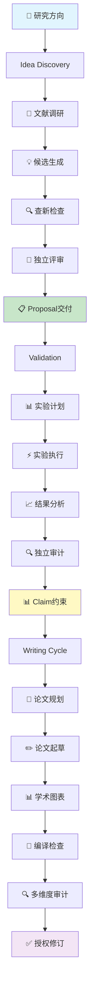
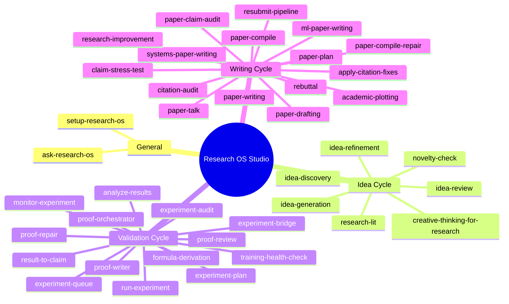
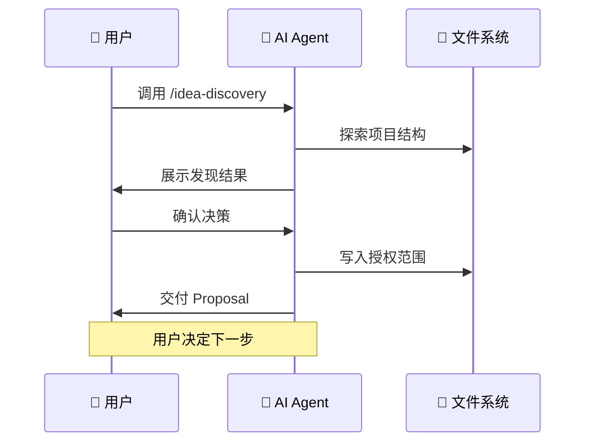

# Research OS Studio - 工作流程图

## 完整工作流程

```mermaid
graph TD
    A[🎯 研究方向] --> B[Idea Discovery]
    B --> C[📝 文献调研]
    C --> D[💡 候选生成]
    D --> E[🔍 查新检查]
    E --> F[👥 独立评审]
    F --> G[📋 Proposal交付]
    
    G --> H[Validation]
    H --> I[📊 实验计划]
    I --> J[⚡ 实验执行]
    J --> K[📈 结果分析]
    K --> L[🔍 独立审计]
    L --> M[📊 Claim约束]
    
    M --> N[Writing Cycle]
    N --> O[📄 论文规划]
    O --> P[✏️ 论文起草]
    P --> Q[📊 学术图表]
    Q --> R[📖 编译检查]
    R --> S[🔍 多维度审计]
    S --> T[✅ 授权修订]
    
    style A fill:#e1f5fe
    style G fill:#c8e6c9
    style M fill:#fff9c4
    style T fill:#f3e5f5
```

## Skills 分类结构

```mermaid
mindmap
  root((Research OS Studio))
    General
      setup-research-os
      ask-research-os
    Idea Cycle
      idea-discovery
      research-lit
      idea-generation
      creative-thinking-for-research
      novelty-check
      idea-review
      idea-refinement
    Validation Cycle
      experiment-plan
      experiment-bridge
      run-experiment
      experiment-queue
      monitor-experiment
      training-health-check
      analyze-results
      experiment-audit
      result-to-claim
      formula-derivation
      proof-writer
      proof-review
      proof-repair
      proof-orchestrator
    Writing Cycle
      paper-writing
      ml-paper-writing
      systems-paper-writing
      paper-plan
      paper-drafting
      academic-plotting
      paper-compile
      paper-compile-repair
      citation-audit
      apply-citation-fixes
      paper-claim-audit
      claim-stress-test
      research-improvement
      rebuttal
      resubmit-pipeline
      paper-talk
```

## 用户控制关键节点

```mermaid
sequenceDiagram
    participant U as 👤 用户
    participant A as 🤖 AI Agent
    participant S as 📁 文件系统
    
    U->>A: 调用 /idea-discovery
    A->>S: 探索项目结构
    A->>U: 展示发现结果
    U->>A: 确认决策
    A->>S: 写入授权范围
    A->>U: 交付 Proposal
    Note over U,A: 用户决定下一步
```
