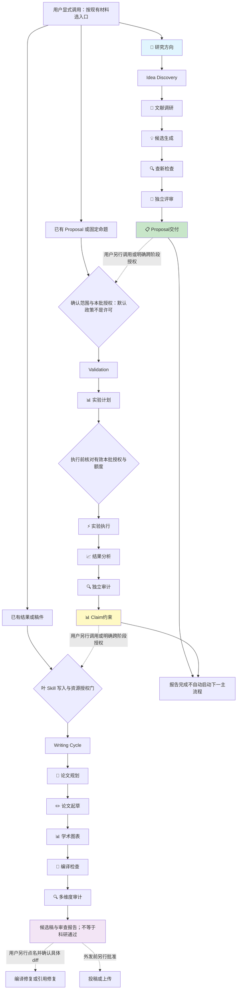
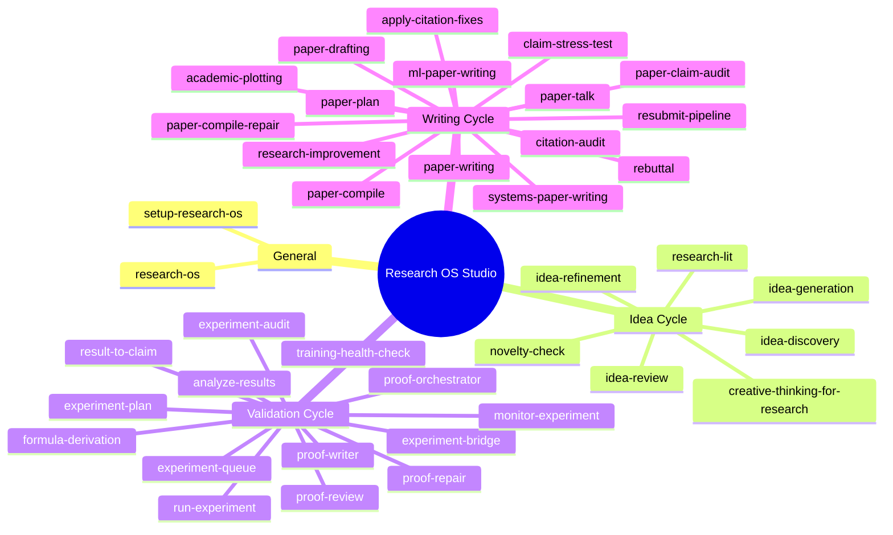
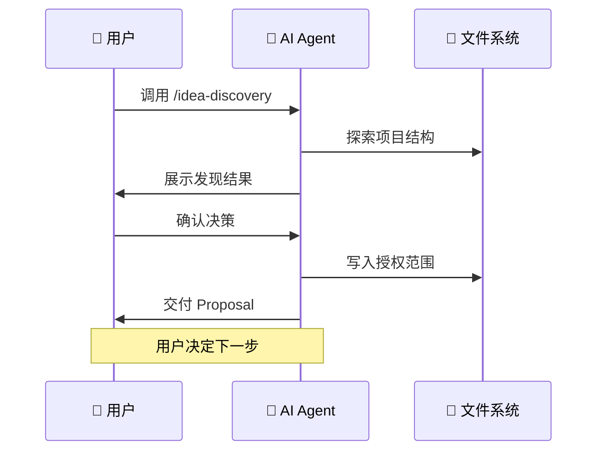

# Research OS Studio - 工作流程图

## 独立入口与授权边界

README 展示可直接维护的 [workflow-v2.svg](workflow-v2.svg)。旧 PNG/JPG 保留为旧视觉资产，不再用于 README 的产品架构图。图是能力地图，不是自动状态机；已有外部 Proposal、结果或稿件都可独立进入相应路线。

## Skills 分类结构

## 用户控制关键节点

