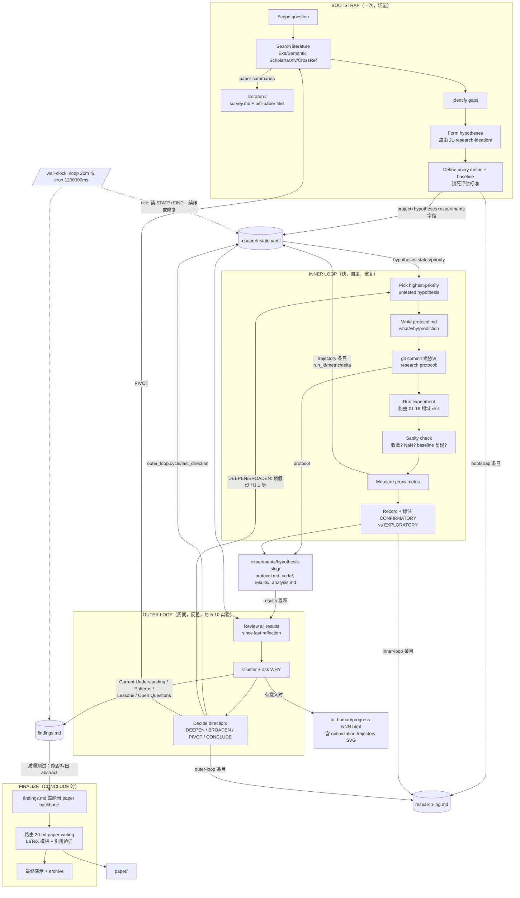

# AI-research-SKILLs 仓库静态调研报告

- 仓库：`Orchestra-Research/AI-research-SKILLs`（本地克隆，只读分析）
- 路径：`analysis/repos/AI-research-SKILLs`
- 规模：98 个 SKILL.md，23 个编号目录 + 辅助目录
- 结论基准：仅实际文件内容，不采信 README

---

## 1. 真实结构树

### 顶层

```
AI-research-SKILLs/
├── 0-autoresearch-skill/          # 核心 orchestrator（本报告重点）
├── 01-model-architecture/ … 19-emerging-techniques/   # 领域知识库（库文档精编）
├── 20-ml-paper-writing/           # workflow：论文写作（4 skills）
├── 21-research-ideation/          # workflow：研究构思（2 skills）
├── 22-agent-native-research-artifact/  # workflow：ARA 研究溯源制品（3 skills）
├── anthropic_official_docs/       # 2 个 Anthropic skills 官方文档拷贝
├── demos/                         # 3 个 autoresearch 实跑案例（含 PDF 论文）
├── dev_data/                      # 开发过程残留（抓取状态、问卷、同步脚本笔记）
├── docs/                          # skill 创作指南、模板、npm 计划、宣传图
├── packages/ai-research-skills/   # npx 交互式安装器（JS，约 5 个源文件）
├── scripts/check-inventory.sh     # 库存校验脚本
├── video-promo/                   # Remotion 宣传视频工程
├── README.md / WELCOME.md / CLAUDE.md / CONTRIBUTING.md / CITATION.cff / package.json
```

### `0-autoresearch-skill/` 完整结构（8 个文件，全仓最小但最核心）

```
0-autoresearch-skill/
├── SKILL.md                        # 412 行。双循环架构主文档：Getting Started / 工作区初始化 /
│                                   #   Two-Loop Architecture / Bootstrap / Inner Loop / Outer Loop /
│                                   #   Agent Continuity(/loop+cron) / Progress Reporting / Git Protocol /
│                                   #   Concluding / Research Discipline / Common Issues
├── references/
│   ├── agent-continuity.md         # 95 行。/loop 与 OpenClaw cron 的具体配置、tick 语义、
│   │                               #   状态文件更新频率表（唯一把"哪个文件多久更新"写成表格的地方）
│   ├── progress-reporting.md       # 166 行。进度报告章节建议 + 一段可直接运行的
│   │                               #   generate_trajectory_svg() Python 代码（无依赖 SVG 轨迹图）
│   └── skill-routing.md            # 219 行。研究活动 → 领域 skill 完整路由表（16 个分类表）
└── templates/
    ├── research-state.yaml         # 58 行。状态文件 schema 模板（有真实字段定义，见 §5）
    ├── findings.md                 # 44 行。叙事综合文件骨架（注释式 schema）
    ├── research-log.md             # 41 行。追加式决策日志，含 20 条高质量示例条目
    └── progress-presentation.html  # 306 行。暗色主题进度演示 HTML 模板
```

注：仓内没有 `experiments/{hypothesis}/` 的模板文件——该目录契约只在 SKILL.md 的目录树注释中声明。

---

## 2. Skill 清单分类表（98 个）

### 分类总览

| 类别 | 数量 | 目录 |
|---|---|---|
| workflow 类（真编排/方法论） | 10 | `0-autoresearch-skill`(1)、`20-ml-paper-writing`(4)、`21-research-ideation`(2)、`22-agent-native-research-artifact`(3) |
| 工程域类（库文档精编，含可运行代码示例） | 88 | `01`–`19` 全部 |
| 纪律检查类 | （并入 workflow） | 纪律条款嵌在 `0-autoresearch-skill/SKILL.md` §Research Discipline 和 `22-*/rigor-reviewer` 内 |
| 营销凑数类 | 0 个 skill，但有凑数资产 | `video-promo/`（Remotion 视频工程）、`docs/`（宣传图）、npm 安装器包装 |

### workflow 类明细

| Skill | 文件 | 实质 |
|---|---|---|
| autoresearch | `0-autoresearch-skill/SKILL.md` | 双循环 orchestrator，全仓唯一真 workflow 引擎 |
| ml-paper-writing | `20-ml-paper-writing/ml-paper-writing/SKILL.md` (982 行) | 论文写作 workflow，含强制引用验证纪律（"NEVER generate BibTeX entries from memory"） |
| systems-paper-writing / academic-plotting / presenting-conference-talks | `20-ml-paper-writing/*/` | 论文写作子领域，有 references+templates |
| brainstorming-research-ideas / creative-thinking-for-research | `21-research-ideation/*/` | 构思框架集（10 个发散透镜），纯方法论文本 |
| ara-research-manager / compiler / rigor-reviewer | `22-agent-native-research-artifact/*/` | 研究溯源制品：会话尾声记录 → 编译成 ARA → 认识论评审。schema 最严密的一组 |

### 19 个编号目录判定：领域知识凑数（非 workflow）

`01`–`19` 共 88 个 skill，结构统一为 `SKILL.md + references/`。抽样 `01-model-architecture/nanogpt/SKILL.md`（290 行）证实其本质 = **第三方库的精编使用手册**（安装命令、config 示例、训练时长），不含任何研究流程编排。`dev_data/SCRAPING_STATUS.md` 直接自证来源：这些 skill 是**批量爬取官方文档生成**（"axolotl (300 pages)… deepspeed (400 pages)… rate_limit: 2.0s"）。

对 Research OS 的价值：**路由目标/执行层素材**，不是流程资产。真正的流程资产只有 `0`、`20`、`21`、`22` 四个目录。

---

## 3. 流程 DAG（以 `0-autoresearch-skill` 实际文件为准）



### 边的出处表

| 边 | 证据（文件:行 + 原文短语） |
|---|---|
| 四阶段总结构 | `0-autoresearch-skill/SKILL.md:64-79` "BOOTSTRAP (once, lightweight)… INNER LOOP… OUTER LOOP… FINALIZE" |
| B2→LIT | SKILL.md:106 "Save everything to `literature/`… Create one file per paper and a running `literature/survey.md`" |
| B4→21 目录路由 | SKILL.md:113-115 "invoke `21-research-ideation/` skills… `brainstorming-research-ideas`… `creative-thinking-for-research`" |
| B5 锁评估 | SKILL.md:120-121 "Set the proxy metric and baseline before running experiments… Lock evaluation criteria upfront" |
| I2→I3 锁协议 | SKILL.md:134-135 "Lock it: commit to git BEFORE running (research(protocol): {hypothesis})… temporal proof your plan existed before results" |
| I4→领域路由 | SKILL.md:157-168 路由表 + `references/skill-routing.md` 全文 |
| I6→STATE trajectory | SKILL.md:174-184 trajectory JSON 示例（run_id/hypothesis/metric_value/baseline/delta） |
| I7→EXP | SKILL.md:142-143 "Record in experiments/{hypothesis-slug}/… CONFIRMATORY vs EXPLORATORY" |
| INNER→OUTER 节奏 | SKILL.md:83 "Typically every 5-10 experiments, or when you notice a pattern, or when progress stalls" |
| O2→FIND | SKILL.md:196-197 "Update findings.md with current understanding"；229-242 "findings.md Is Your Project Memory" |
| O3 四方向 | SKILL.md:207-227 DEEPEN/BROADEN/PIVOT/CONCLUDE 定义段 |
| O3→I1 回环 | SKILL.md:211 "Action: generate sub-hypotheses (H1.1, H1.2) → back to inner loop" |
| O3→B2 pivot | SKILL.md:218-219 "Action: return to literature with new questions → re-bootstrap" |
| O2→RPT | SKILL.md:202 "If there's something meaningful, generate a progress presentation" |
| FIND→F1 | SKILL.md:242 "a human should be able to read findings.md and write a paper abstract from it" |
| F2→20 目录 | SKILL.md:335 "Invoke the `20-ml-paper-writing` skill — it has LaTeX templates for NeurIPS, ICML, ICLR, ACL, AAAI, COLM" |
| LOOP 机制 | SKILL.md:253 `/loop 20m Continue autoresearch…`；`references/agent-continuity.md:16` 同文 |
| LOOP↔研究循环解耦 | SKILL.md:284 "The `/loop` and cron job are purely wall-clock rhythm. They are completely separate from your research loops" |
| Git 协议边 | SKILL.md:327 "Protocol commits MUST precede result commits. Never combine them." |

---

## 4. 自动推进点清单

grep 全仓 `/loop`、自动继续、链式调用，有效命中（排除领域 skill references 里无关的 "proceed" 散文）：

| # | 文件:行 | 原文摘录 |
|---|---|---|
| 1 | `0-autoresearch-skill/SKILL.md:16` | "**This runs fully autonomously.** Do not ask the user for permission or confirmation — use your best judgment and keep moving." |
| 2 | `0-autoresearch-skill/SKILL.md:29` | "If things are clear, don't over-discuss — proceed to full autoresearch." |
| 3 | `0-autoresearch-skill/SKILL.md:31` | "**Step 0 — before anything else**: Set up the agent continuity loop… This is MANDATORY." |
| 4 | `0-autoresearch-skill/SKILL.md:150` | "**Never stop.** Even if something fails, find a path forward… The `/loop` and heartbeat mechanisms will keep you going" |
| 5 | `0-autoresearch-skill/SKILL.md:253` | `/loop 20m Continue autoresearch. Read research-state.yaml and findings.md… never idle, never stop…`（完整 tick prompt，含最终自动调 ml-paper-writing） |
| 6 | `0-autoresearch-skill/SKILL.md:264-273` | OpenClaw `cron.add` JSON：`"everyMs": 1200000`, `sessionTarget: "current"`, payload 同 #5 |
| 7 | `0-autoresearch-skill/SKILL.md:290` | "Never idle. Always be making progress." |
| 8 | `0-autoresearch-skill/SKILL.md:340` | "Proceed autonomously through the writing process. If the ml-paper-writing skill suggests human collaboration points, adapt and keep going" |
| 9 | `0-autoresearch-skill/SKILL.md:351` | "**Never stop**: Don't wait for human approval on routine decisions." |
| 10 | `0-autoresearch-skill/references/agent-continuity.md:16` | `/loop 20m Continue autoresearch…` 精简版 tick prompt |
| 11 | `0-autoresearch-skill/references/agent-continuity.md:46-56` | cron.add 配置 + "Set up… as your very first action" |
| 12 | `22-agent-native-research-artifact/research-manager/SKILL.md:274` | "Create the full directory structure and seed files automatically. Do not ask." |
| 13 | `README.md:539` / `WELCOME.md:26` | 宣传层复述 "Mandatory `/loop`… for continuous autonomous operation"（非机制本体） |

要点：全仓自动推进机制**只有一处真身**——`/loop 20m` 定时 prompt 注入（Claude Code）或 OpenClaw cron（`everyMs:1200000`），且作者明确声明它与研究内/外循环解耦（SKILL.md:284），tick 只是"读状态文件 → 续作/修复"的 nudge。无 AUTO_PROCEED 变量、无脚本级自动链式调用；跨 skill 链式（autoresearch→ml-paper-writing）靠 prompt 文本约定（#5、#8）。

---

## 5. 状态文件契约核实

| 契约物 | 是否真定义 schema | 证据 |
|---|---|---|
| `research-state.yaml` | **是，最完整** | `templates/research-state.yaml` 58 行完整字段：`project{title,question,status: active\|paused\|concluded}`、`hypotheses[]{id,statement,status: pending\|active\|supported\|refuted\|inconclusive,parent,priority}`、`experiments{proxy_metric,baseline_value,best_value,trajectory[]{run_id,metric_value,delta,wall_time_min}}`、`outer_loop{cycle,last_direction: deepen\|broaden\|pivot\|conclude}`、`workspace{}` 路径指针。含枚举值，可直接当 schema 用 |
| `findings.md` | 半 schema（注释式） | `templates/findings.md` 7 个固定 section：Research Question / Current Understanding / Key Results / Patterns and Insights / Lessons and Constraints / Open Questions / Optimization Trajectory。每节有 HTML 注释说明写什么，Lessons 节给了 4 条具体范例（"Weight decay > 0.1 causes training instability at 125M param scale"） |
| `research-log.md` | 半 schema（表格+类型枚举） | `templates/research-log.md`：append-only 表 `\| # \| Date \| Type \| Summary \|`，Type 枚举 6 种（bootstrap/inner-loop/outer-loop/pivot/report/conclude），附 20 条真实感示例（含 val_loss 数字、DEEPEN/BROADEN 决策理由） |
| `experiments/{hypothesis}/` | **只有目录树，无文件级 schema** | SKILL.md:46-50 仅注释：`protocol.md # What, why, and prediction`、`analysis.md # What we learned`。protocol.md 的字段、analysis.md 的结构**没有任何模板文件**。这是契约的最大缺口 |
| `literature/` | 弱契约 | SKILL.md:106 文字描述字段（title, authors, year, key findings, relevance, URL/DOI），无模板文件 |
| `to_human/` | 有模板 | `templates/progress-presentation.html`（306 行）+ `references/progress-reporting.md` 章节清单 + 可运行 SVG 轨迹图代码 |
| 更新频率契约 | 有，唯一出处 | `references/agent-continuity.md:87-92` 表格：state.yaml="After every experiment and reflection"、log="After every significant action"、findings="After every outer loop"、results="After every experiment" |

对照：`22-agent-native-research-artifact/` 的 ARA schema（exploration_tree.yaml 节点类型表、claims.md 状态机、provenance 标签体系）比 autoresearch 的契约严密一个量级，两者可互补。

---

## 6. 内容质量抽样（1-10 分）

### 6.1 `0-autoresearch-skill/SKILL.md`（412 行）—— 8/10

实质证据：
- Git 预注册纪律可执行："Lock it: commit to git BEFORE running (research(protocol): {hypothesis})… temporal proof your plan existed before results"（:134-135）；"Protocol commits MUST precede result commits. Never combine them."（:327）
- 质量测试可操作："After 30 inner loop experiments, a human should be able to read findings.md and write a paper abstract from it. If they can't, the outer loop isn't synthesizing — it's just logging."（:242）
- Common Issues 段（:381-405）是真排障手册而非套话："Results contradict baseline expectations → the published baseline may be wrong, or conditions differ"

空话残留："Humans love seeing the upward curve"（:186）、"this is where novelty comes from"（:75）。扣分点：experiments 目录契约缺席（见 §5）；"Never stop" 重复 5 次，有打鸡血味。

### 6.2 `templates/research-log.md` —— 9/10（全仓信息密度最高文件之一）

41 行里塞了两条完整示例轨迹。示例不是占位符，而是带真实决策逻辑的 mini case：
> "| 7 | 2026-03-16 | outer-loop | Reviewed 5 runs. Pattern: gating mechanisms (SwiGLU) and rotary embeddings (RoPE) give independent gains that stack… But WHY do they stack? Hypothesis: they operate on orthogonal aspects… Direction: DEEPEN — test if adding RMSNorm also stacks independently. |"（:24）

grokking "sleep phase" 示例（:30-39）演示了阴性结果→机制解释→文献回查的完整 outer loop。这是最好的 few-shot 教材，可直接抽取。

### 6.3 `01-model-architecture/nanogpt/SKILL.md`（290 行，领域类代表）—— 6/10

是精编的库使用手册：可复制的安装/训练命令、完整 config 块、训练时长估计（"~4 days (8× A100)"）。但零研究流程内容——没有假设、没有评估设计、没有状态衔接。`dev_data/SCRAPING_STATUS.md` 自证批量爬取生成。对 Research OS 仅作执行层路由目标有价值。其余 87 个领域 skill 同质。

### 6.4 `22-agent-native-research-artifact/research-manager/SKILL.md`（325 行）—— 8.5/10

契约密度全仓最高：事件分类表（8 类 → 路由目标文件）、provenance 四级标签（user/ai-suggested/ai-executed/user-revised，"Default to `ai-suggested` when uncertain. Never mark inferences as `user`" :69）、exploration_tree.yaml 节点类型必填字段表（:200-208）、"Never upgrade provenance"（:313）。且定位克制："NEVER during a task… ONLY after the task is complete"（:19-21）——尾声记录器，不与 autoresearch 冲突，可拼接。

---

## 7. 可抽取资产结论（按价值排序）

| 排名 | 资产 | 路径 | 为什么抽 |
|---|---|---|---|
| 1 | 双循环 + 四方向决策架构全文 | `0-autoresearch-skill/SKILL.md` §Two-Loop/§Inner/§Outer/§Deciding Direction（:60-242） | Research OS 的引擎蓝图；DEEPEN/BROADEN/PIVOT/CONCLUDE 判据可直接变成状态机转移条件 |
| 2 | research-state.yaml schema | `0-autoresearch-skill/templates/research-state.yaml` | 唯一机器可读状态契约，含枚举值，可直接落地为 OS 的状态存储 |
| 3 | /loop tick prompt + 状态文件更新频率表 | `0-autoresearch-skill/SKILL.md:253` + `references/agent-continuity.md:87-92` | 自动推进机制的全部实质：定时 nudge + 文件即记忆 + tick 与研究循环解耦。对"用户控制型"OS 需改造：去掉 "Do not ask the user"，把 tick 决策权还给用户 |
| 4 | research-log.md 示例语料 | `0-autoresearch-skill/templates/research-log.md` | 20 条带数字、带决策理由的高质量 few-shot，教 agent 什么叫"好的日志条目" |
| 5 | Git 预注册协议 | `0-autoresearch-skill/SKILL.md:315-327` | commit message 模式表 + "protocol 必须先于 results" 硬规则，零成本移植 |
| 6 | ARA provenance/溯源体系 | `22-agent-native-research-artifact/research-manager/SKILL.md` + `rigor-reviewer/SKILL.md` | 用户控制型 OS 天然需要区分 user/AI 贡献；provenance 标签 + 六维评审是现成方案 |
| 7 | optimization trajectory SVG 生成器 | `0-autoresearch-skill/references/progress-reporting.md:70-126` | 70 行无依赖 Python，直接可用做 OS 的进度可视化 |
| 8 | skill-routing 路由表模式 | `0-autoresearch-skill/references/skill-routing.md` | "活动 → skill 位置"二级表结构可作为 OS 的能力注册表格式（内容本身即 88 个领域 skill，按需引用不必搬运） |
| 9 | findings.md 质量测试 | `0-autoresearch-skill/SKILL.md:242` | "30 实验后能否写出 abstract" 一句话验收标准，可直接做 OS 的外循环健康检查 |

明确不抽：88 个领域 skill（库手册，与 OS 架构无关）、`video-promo/`、`packages/` 安装器、`demos/`（仅可作效果佐证阅读）。
