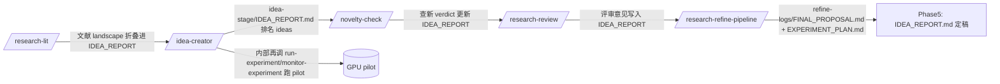
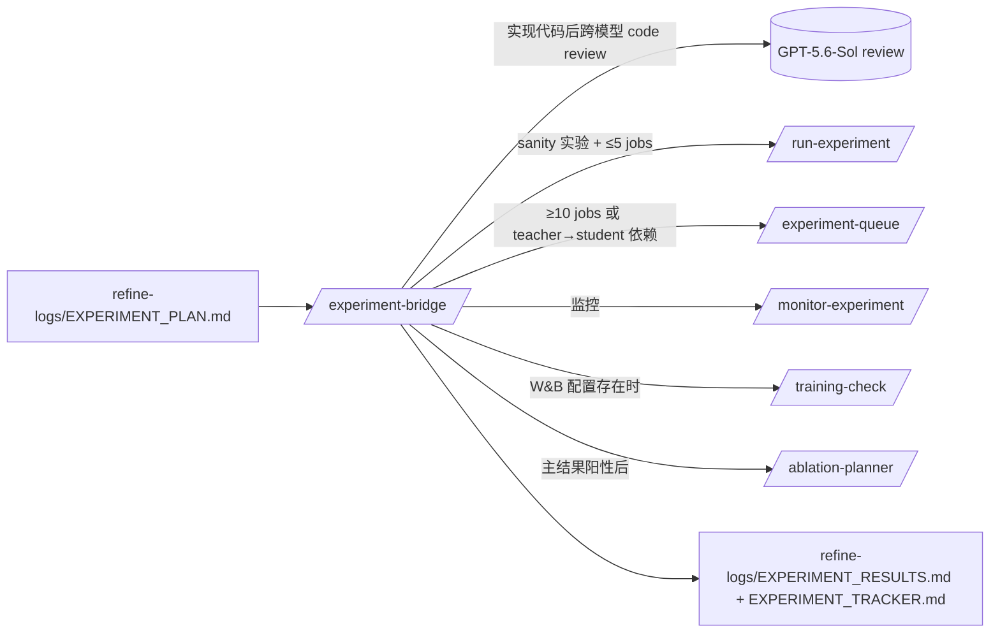
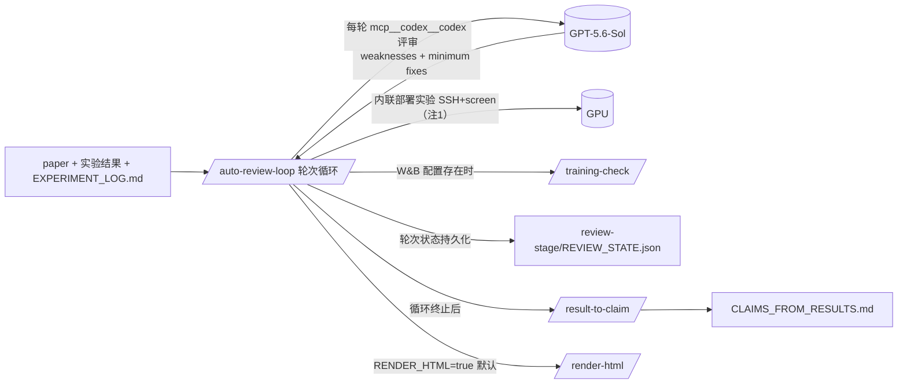
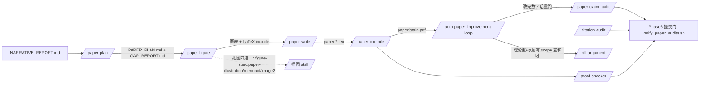
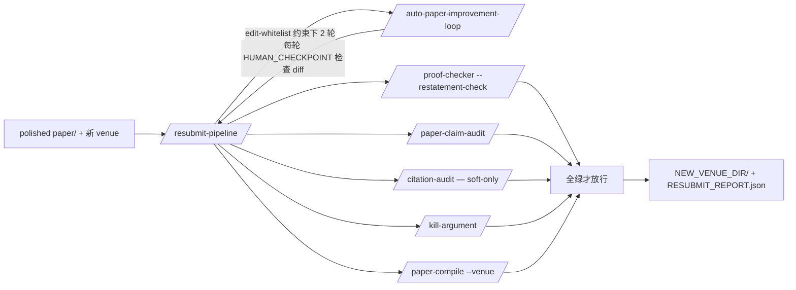
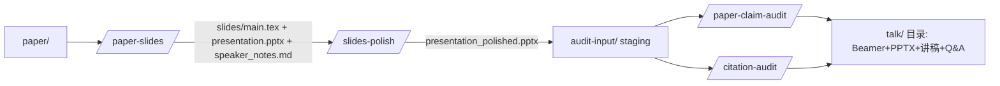
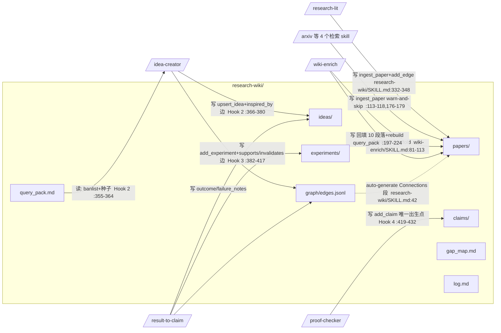

# ARIS 仓库静态分析报告

- 仓库：`analysis/repos/ARIS`（Auto-claude-code-research-in-sleep）
- 方法：只读静态分析；所有结论带文件路径证据；README 仅用于定位，论断均以 SKILL.md / tools / shared-references 实际内容为准
- 日期：2026-08-28

---

## 1. 真实结构树

```
ARIS/
├── AGENT_GUIDE.md            # 给 AI agent 的路由索引（211 行），W 链与 artifact 契约的权威索引
├── README.md / README_CN.md  # 1796 行宣传+文档；含 W1–W6 的 ASCII 流程图（834–1218 行）
├── SETUP_GUIDE{,_CN}.md      # 安装指南
├── xhs_post.md               # 小红书营销贴（非科研资产）
├── .env.example              # API key 模板
│
├── skills/                   # 86 个顶层目录 = 82 个主线 skill + 4 个非 skill 目录
│   ├── <82 个 skill>/SKILL.md        # 主线，每个含 frontmatter + 流程
│   ├── shared-references/            # 31 个共享契约 md（assurance-contract、reviewer-independence、
│   │                                 #   integration-contract、external-cadence、acceptance-gate 等）
│   ├── skills-codex/                 # Codex CLI 镜像（每个子目录一份 SKILL.md，spawn_agent 替换 MCP 调用）
│   ├── skills-codex-claude-review/   # Codex + Claude 评审 overlay
│   └── skills-codex-gemini-review/   # Codex + Gemini 评审 overlay
│
├── tools/                    # ~40 个真实可执行 helper（Python/shell），是仓库里唯一的"代码"资产
│   ├── research_wiki.py      # 767 行，wiki 的唯一实现（init/ingest_paper/add_edge/upsert_idea/add_experiment/add_claim...）
│   ├── run_state.py + idea_discovery_gate.py + iteration_log.py   # 可恢复运行状态机 + 阶段证据门
│   ├── review_gate.py / forensics_gate.py / verify_paper_audits.sh # 提交前审计验证器
│   ├── arxiv_fetch.py / openalex_fetch.py / semantic_scholar_fetch.py / deepxiv_fetch.py / exa_search.py
│   ├── capture_filter.py / threat_scan.py / provenance.py          # 注入防护 / 溯源
│   ├── experiment_queue/     # SSH 批量实验队列（build_manifest + queue_manager）
│   ├── meta_opt/             # skill 语料自优化
│   └── install_aris.{sh,ps1} / smart_update.* / skill-groups.tsv   # 安装/更新/分组目录（唯一权威 skill 分组表）
│
├── templates/                # 19 个模板：RESEARCH_BRIEF / NARRATIVE_REPORT / EXPERIMENT_PLAN /
│                             #   EXPERIMENT_LOG / IDEA_CANDIDATES / RESEARCH_CONTRACT / PATENT_* 等
├── mcp-servers/              # 7 个 MCP 服务：claude-review / gemini-review / codex-image2 /
│                             #   feishu-bridge / llm-chat / manual-review / minimax-chat（跨模型评审后端）
├── docs/                     # 50+ 文档：SKILLS_CATALOG.md、各平台适配指南（Cursor/Trae/Copilot/OpenClaw...）、
│                             #   WATCHDOG/SESSION_RECOVERY/MANUAL_REVIEW 指南、宣传 HTML/slides
├── tests/                    # pytest 套件（~25+ 测试文件，覆盖 wiki/run_state/installer/auto_proceed 契约）
├── aris-monitor/             # 终端监控 widget（scanner/ticker/focus）
├── community_papers/         # 1 个 PDF（UAV-CC.pdf）
└── assets/                   # 图片资源
```

**skills/ 命名分组规律**（依据 `tools/skill-groups.tsv`，10 组，是唯一权威分组；`tests/test_skill_groups.py` 强制完整性）：

| 组 | 数量 | 前缀/命名规律 |
|---|---|---|
| lit-search | 10 | 数据源名（arxiv/openalex/semantic-scholar/exa-search/gemini-search/deepxiv/alphaxiv...） |
| ideation | 9 | `idea-*` / `research-*`（research-lit/refine/wiki/pipeline） |
| review-loop | 5 | `auto-review-loop*` / `kill-argument` |
| theory | 4 | `proof-*` / `formula-*` |
| experiments | 15 | `experiment-*` / GPU 平台名（vast-gpu/qzcli/serverless-modal） |
| paper-core | 12 | `paper-*` / `*-audit` |
| paper-visuals | 10 | `paper-{illustration,poster,slides,talk}` / `figure-*` / `pixel-art` |
| submission | 3 | rebuttal / resubmit-pipeline / grant-proposal |
| patent | 8 | `patent-*` / claims-drafting / invention-structuring / jurisdiction-format... |
| meta-utils | 4 | `meta-*` / feishu-notify / interview-cheatsheet |

（各组数量按 skill-groups.tsv 实列计，合计约 80，与 82 的 ±2 差异为分组表与实际目录的漂移；AGENT_GUIDE.md:27 自述"82 skills"。）

---

## 2. Skill 清单分类表（82 个主线 skill 全列）

分类依据：各 SKILL.md frontmatter description + 正文抽查；行数 = SKILL.md 行数（体量参考）。「实质」指含可执行命令/artifact 契约/检查清单；「（推断）」= 未全文精读。

### A. Workflow 类（推动科研阶段；链式调用其他 skill）

| skill | 行数 | 阶段 | 实质判断 |
|---|---|---|---|
| research-pipeline | 390 | 总编排 W1→W1.5→W2→W3 | 实质（run_state 断点恢复 + accept 门槛） |
| idea-discovery | 527 | W1 | 实质（见 §6） |
| idea-discovery-robot | 363 | W1 机器人特化 | 实质（推断，同构 W1） |
| idea-creator | 584 | W1 子环节 | 实质（wiki 读写 + threat_scan 门） |
| research-lit | 756 | W1 子环节（综述） | 实质（多源搜索 + wiki ingest hook） |
| research-refine | 770 | W1 子环节 | 实质（推断，迭代评审 refine） |
| research-refine-pipeline | 186 | refine+plan 串联 | 实质但薄（编排两 skill，输出 refine-logs/ 6 文件契约） |
| experiment-plan | 249 | W1 末段 | 实质（见 §6） |
| experiment-bridge | 376 | W1.5 | 实质（计划→代码→部署→结果全链，含 job 数自动路由） |
| auto-review-loop | 1137 | W2 | 实质（全仓最长 skill，轮次状态机 + REVIEW_STATE.json） |
| auto-review-loop-llm | 259 | W2 变体（任意 OpenAI 兼容 API） | 实质（推断） |
| auto-review-loop-minimax | 302 | W2 变体（MiniMax） | 实质（推断） |
| paper-writing | 925 | W3 | 实质（6 Phase + 提交门 verify_paper_audits.sh） |
| paper-plan | 386 | W3 子环节 | 实质（推断，claims-evidence matrix） |
| paper-write | 651 | W3 子环节 | 实质（推断，含 DBLP→CrossRef 反幻觉 bib 链） |
| paper-figure | 312 | W3 子环节 | 实质（推断） |
| paper-compile | 266 | W3 子环节 | 实质（编译修错 + 页数检查 + COMPILE_REPORT.json） |
| auto-paper-improvement-loop | 673 | W3 末段 | 实质（review→fix→recompile 循环 + edit-whitelist） |
| rebuttal | 376 | W4 | 实质（issue 原子化 + 字符预算 + 6 lint + 双版本输出） |
| resubmit-pipeline | 447 | W5 | 实质（7 态 RESUBMIT_REPORT.json + edit-whitelist 硬约束） |
| paper-talk | 381 | W6 | 实质（编排 paper-slides/slides-polish/审计） |
| dse-loop | 296 | 架构/EDA 调参循环 | 实质（推断，领域内自循环） |
| grant-proposal | 698 | 基金申请 | 实质（推断，编排 research-lit/novelty-check/research-review） |
| patent-pipeline | 344 | 专利总编排 | 实质（编排 7 个专利子 skill，AUTO_PROCEED 默认 false） |
| invention-structuring | 188 | 专利子环节 | （推断）领域实质 |
| claims-drafting | 227 | 专利子环节 | （推断）领域实质 |
| embodiment-description | 129 | 专利子环节 | （推断） |
| specification-writing | 211 | 专利子环节 | （推断） |
| figure-description | 138 | 专利子环节 | （推断） |
| jurisdiction-format | 192 | 专利子环节 | （推断，引用 shared-references/patent-format-{cn,us,ep}.md） |
| prior-art-search | 146 | 专利子环节 | （推断） |
| wiki-enrich | 257 | wiki 维护 | 实质（填 TODO scaffold + 5 源 fallback 链） |
| research-wiki | 461 | 知识库基座 | 实质（见 §6） |

小计：33

### B. 纪律检查类（audit / check / 对抗评审；多为"零上下文跨模型裁决 + 机器可读 verdict"）

| skill | 行数 | 裁决物 |
|---|---|---|
| experiment-audit | 311 | EXPERIMENT_AUDIT.{md,json}（评估代码诚实度） |
| result-to-claim | 311 | 结果→claim 裁决 + wiki edges |
| paper-claim-audit | 348 | PAPER_CLAIM_AUDIT.{md,json}（见 §6） |
| citation-audit | 502 | CITATION_AUDIT.{md,json}（存在性+元数据+语境三层） |
| kill-argument | 437 | KILL_ARGUMENT.{md,json}（双线程攻击-裁决） |
| integrity-forensics | 284 | 投稿前诚信取证扫描 |
| proof-checker | 866 | PROOF_AUDIT.json；wiki claim 唯一出生点 |
| proof-orchestrator | 254 | 证明项目编排（run-dir 状态化）（推断） |
| proof-writer | 223 | 证明撰写（推断） |
| formula-derivation | 280 | 公式推导（推断） |
| novelty-check | 142 | 查新 verdict（PROCEED/CAUTION/ABANDON） |
| research-review | 223 | 外部批判评审 |
| patent-review | 203 | 专利审查（推断） |
| patent-novelty-check | 153 | 专利查新（推断） |
| training-check | 132 | W&B 训练健康检查（NaN/发散/平台期） |
| ablation-planner | 123 | 消融规划（读 result-to-claim verdict 触发） |
| meta-optimize | 437 | skill 语料自优化提案（对 ARIS 自身的 audit） |
| meta-apply | 141 | 落地语料补丁（人工批准门） |

小计：18

### C. 工程域类（GPU/LaTeX/搜索/平台适配/工具胶水）

| skill | 行数 | 领域 |
|---|---|---|
| run-experiment | 313 | GPU 部署（local/SSH/vast/modal 四后端 + W&B 注入）（见 §6） |
| monitor-experiment | 140 | 进度监控/结果收集（天然的 /loop 候选，SKILL.md:11 自述） |
| experiment-queue | 431 | SSH 批量队列（OOM 重试、wave 门、崩溃安全状态） |
| vast-gpu | 394 | vast.ai 租卡全生命周期 |
| serverless-modal | 335 | Modal serverless GPU |
| qzcli | 324 | 启智平台作业管理 |
| system-profile | 103 | GPU 环境画像 |
| arxiv | 248 | arXiv 搜索/下载/入库（含 wiki ingest hook，SKILL.md:187-230） |
| openalex | 237 | OpenAlex 引用图谱（推断） |
| semantic-scholar | 236 | S2 检索（推断） |
| gemini-search | 231 | Gemini 文献发现（推断） |
| exa-search | 205 | Exa 网页搜索（推断） |
| deepxiv | 263 | DeepXiv 渐进阅读（推断） |
| alphaxiv | 196 | AlphaXiv 单篇速读（推断） |
| web-debug-search | 334 | 调试检索（GitHub/SE/中文社区） |
| overleaf-sync | 220 | Overleaf 双向同步 |
| render-html | 316 | MD/JSON artifact → HTML + 渲染保真评审门 |
| figure-spec | 262 | 确定性 SVG 架构图（scripts 自包含 helper） |
| mermaid-diagram | 419 | Mermaid 图生成 |
| paper-illustration | 736 | Gemini/Nano Banana 论文插图 |
| paper-illustration-image2 | 391 | Codex 原生画图备选 |
| paper-slides | 635 | Beamer→PDF+PPTX |
| slides-polish | 565 | 逐页 Codex 排版评审 |
| paper-poster-html | 323 | HTML 学术海报 |
| feishu-notify | 156 | 飞书通知（含交互式审批门） |
| comm-lit-review | 297 | 通信领域专用综述（推断） |

小计：27

### D. 营销凑数 / 与科研主线无关 / 空泛类

| skill | 行数 | 判断依据 |
|---|---|---|
| pixel-art | 137 | 像素画 SVG 生成；description 自述用于 "README hero image"；内容是调色板+网格模板，与科研主线零关系（SKILL.md:3,12-40） |
| paper-poster | 19 | 已废弃，纯 redirect 到 paper-poster-html（description: "DEPRECATED — superseded"） |
| interview-cheatsheet | 245 | ML 面试速查手册生成；与科研流程无关（skill-groups.tsv 归入 meta-utils，自述"面试准备"） |
| analyze-results | 46 | 空泛：46 行通用建议（"compute mean +/- std"、"flag outliers"），无 artifact 路径契约、无命令、无检查清单（见 §6） |
| writing-systems-papers | 184 | 写作建议文档（段落级 blueprint），无 artifact 契约；属"经验贴"型（推断） |

小计：5

> 分类统计：workflow 33 / 纪律检查 18 / 工程域 27 / 凑数或空泛 5（约 6%）。凑数率低；主要"水分"在薄 skill（analyze-results 46 行、novelty-check 142 行、monitor-experiment 140 行这类通用建议体）。

---

## 3. W1–W6 链 DAG

**链的真实定义出处**：`AGENT_GUIDE.md:82-94`（Workflow Index 表：W1=idea-discovery、W1.5=experiment-bridge、W2=auto-review-loop、W3=paper-writing、W4=rebuttal、W5=resubmit-pipeline、W6=paper-talk）。README.md:804-814 给出同构总流水线。以下边证据全部来自编排 skill 的 SKILL.md 实际调用行。

### W1：Idea Discovery（编排者：`skills/idea-discovery/SKILL.md`）



边出处表：

| 边 | 证据 |
|---|---|
| idea-discovery → research-lit | idea-discovery/SKILL.md:204-213 `Invoke /research-lit ... — composed: idea-stage/IDEA_REPORT.md` |
| idea-discovery → idea-creator | :247-250 `Invoke /idea-creator with the landscape context` |
| idea-discovery → novelty-check | :299-301 `/novelty-check "[top idea 1 description]"`（每个 top idea 一次） |
| idea-discovery → research-review | :316 `/research-review "[top idea...]" — composed: idea-stage/IDEA_REPORT.md` |
| idea-discovery → research-refine-pipeline | :333 `/research-refine-pipeline "[top idea description + pilot results + reviewer feedback]"` |
| idea-creator → run-experiment/monitor-experiment（pilot） | idea-creator/SKILL.md:14 `Phases 4-5 invoke /novelty-check, /run-experiment, and /monitor-experiment for validation and pilots` |
| research-refine-pipeline → research-refine + experiment-plan | research-refine-pipeline/SKILL.md:19-21 `composes two existing workflows: research-refine ... experiment-plan` |

### W1.5：Experiment Bridge（编排者：`skills/experiment-bridge/SKILL.md`）



边出处表：

| 边 | 证据 |
|---|---|
| bridge → run-experiment | experiment-bridge/SKILL.md:179, 224-226 `Small batch (≤5 jobs per milestone) → use /run-experiment directly` |
| bridge → experiment-queue | :234 `if any milestone ... declares ≥10 jobs ... route that milestone to /experiment-queue` |
| bridge → monitor-experiment | :240 `Use /monitor-experiment to track progress (reads from queue_state.json...)` |
| bridge → training-check | :263 `if W&B data is available ... invoke /training-check` |
| bridge → ablation-planner | :320 `After main experiments (M2) complete with positive results, invoke /ablation-planner` |
| 输入 EXPERIMENT_PLAN.md | :19 头部 artifact 表 + research-pipeline/SKILL.md:215 `Parses refine-logs/EXPERIMENT_PLAN.md` |

### W2：Auto Review Loop（编排者：`skills/auto-review-loop/SKILL.md`）



边出处表：

| 边 | 证据 |
|---|---|
| 循环条件 | auto-review-loop/SKILL.md:25-26 `MAX_ROUNDS = 4 / POSITIVE_THRESHOLD: score >= 6/10 AND verdict ∈ {"ready","almost"}`；:19 `review → implement fixes → re-review` |
| 状态持久化 | :166 `"pending_experiments": [...]`（REVIEW_STATE.json 片段）；AGENT_GUIDE.md:144 |
| 注1：实验执行为**内联**而非调用 /run-experiment | :849-850 `1. Code changes... 2. Run experiments: Deploy to GPU server via SSH + screen/tmux`；全文件无 `/run-experiment` 调用（grep 无命中）——README.md:985 宣称的 supporting skills 在此 skill 内无证据，属"文档宣称但无 skill 内证据" |
| → training-check | :865 `if W&B is configured, invoke /training-check` |
| → result-to-claim | :948 `invoke /result-to-claim to convert experiment results ... Output: CLAIMS_FROM_RESULTS.md` |
| → render-html | :954-958 `invoke /render-html on the cumulative review log`（默认开，非阻塞） |

### W3：Paper Writing（编排者：`skills/paper-writing/SKILL.md`）



边出处表：

| 边 | 证据 |
|---|---|
| 总链 | paper-writing/SKILL.md:17 `/paper-plan → /paper-figure → /paper-write → /paper-compile → /auto-paper-improvement-loop` |
| → paper-plan | :145-148 `Invoke /paper-plan ...` |
| → paper-figure | :276-279 `Invoke /paper-figure ... "PAPER_PLAN.md"` |
| → 插图 skill 四分支 | :299/310/319/328 `When illustration: figurespec ... invoke /figure-spec`（gemini/mermaid/codex-image2 同构） |
| → paper-write | :371-374 |
| → paper-compile | :403-406 `Invoke /paper-compile to build the PDF` |
| → proof-checker | :438 `Run /proof-checker "paper/"` |
| → paper-claim-audit（两次） | :459 `Run /paper-claim-audit "paper/"`；:503-522 `After /auto-paper-improvement-loop finishes, rerun /paper-claim-audit ...` |
| → auto-paper-improvement-loop | :474-477 |
| → kill-argument | :534 `After Phase 5.5 (claim audit) passes, run /kill-argument whenever the paper is theory-heavy...` |
| Phase6 提交门 | AGENT_GUIDE.md:112 `Phase 6 of /paper-writing runs tools/verify_paper_audits.sh and refuses to emit the Final Report if ANY layer is non-green`；paper-claim-audit/SKILL.md:276-278 反向印证 |

### W4：Rebuttal（编排者：`skills/rebuttal/SKILL.md`）


边出处表：

| 边 | 证据 |
|---|---|
| → experiment-bridge | rebuttal/SKILL.md:49 `AUTO_EXPERIMENT ... automatically invoke /experiment-bridge`；:156-158 `Invoke /experiment-bridge with the mini plan: /experiment-bridge "rebuttal/REBUTTAL_EXPERIMENT_PLAN.md"` |
| stress test | :58-62 `branch on REVIEWER_BACKEND: Use mcp__codex__codex for new review threads`；:275 给出 codex 调用块 |
| 输出契约 | :343-353 `... PASTE_READY.txt and REBUTTAL_DRAFT_rich.md are the canonical outputs`；AGENT_GUIDE.md:92 |
| → render-html | :343-346 |

### W5：Resubmit Pipeline（编排者：`skills/resubmit-pipeline/SKILL.md`）



边出处表：

| 边 | 证据 |
|---|---|
| → auto-paper-improvement-loop（HUMAN_CHECKPOINT=true） | resubmit-pipeline/SKILL.md:206-218 `invokes the loop once with HUMAN_CHECKPOINT = true so each round pauses for the orchestrator to inspect the diff` |
| → proof-checker / paper-claim-audit / citation-audit | :142-144 三行审计表（含 verdict 文件名列） |
| → kill-argument | :269 `/kill-argument $NEW_VENUE_DIR/` |
| → paper-compile | :292-295 `/paper-compile $NEW_VENUE_DIR/main.tex --venue $TARGET_VENUE` |
| 放行条件 | :364-365 `All audits non-blocking — ... all return verdict ∈ {PASS, NOT_APPLICABLE}` |

### W6：Paper Talk（编排者：`skills/paper-talk/SKILL.md`）



边出处表：

| 边 | 证据 |
|---|---|
| → paper-slides | paper-talk/SKILL.md:154-158 `Invoke /paper-slides to generate Beamer source + PPTX ...`（:134 另有 Phase-1-only 委托分支） |
| → slides-polish | :179-186 `Invoke /slides-polish against the freshly generated PPTX` |
| → paper-claim-audit | :240 `Invoke /paper-claim-audit against the staged input. Scope is slide ...` |
| → citation-audit | :258 `Invoke /citation-audit over the staged input.` |
| 输出目录契约 | :71-96 文件清单（main.tex / presentation.pptx / TALK_SCRIPT.md / audit-input/ ...） |

**跨链说明**：W1→W1.5→W2→W3 的链间衔接由 `research-pipeline`（AGENT_GUIDE.md:82 `/research-pipeline = W1 → W1.5 → W2 → W3`）承担，调用证据：research-pipeline/SKILL.md:170（/idea-discovery）、:209（/experiment-bridge）、:241（/auto-review-loop）、:333（/paper-writing，仅 AUTO_WRITE=true）。W4–W6 无自动衔接，需人工触发（AGENT_GUIDE.md:83 `Post-paper: W4 (rebuttal), W5 (resubmit), W6 (talk)` 为独立入口）。

---

## 4. research-wiki 目录契约

### 4.1 目录结构（research-wiki/SKILL.md:60-78；实现 = tools/research_wiki.py，767 行）

```
research-wiki/
  index.md          # 分类索引（auto-generated）
  log.md            # append-only 时间线（每次 mutation 必写，:455）
  gap_map.md        # 领域缺口，稳定 ID（G1, G2, ...）
  query_pack.md     # 给 /idea-creator 的压缩摘要，硬上限 8000 chars（:263-279）
  papers/<slug>.md      # 每篇论文一页，frontmatter schema 固定在 :204-253
  ideas/<idea_id>.md    # 每个 idea 一页
  experiments/<exp_id>.md
  claims/<claim_id>.md  # 唯一出生点 = /proof-checker（Hook 4, :419-436）
  graph/edges.jsonl     # 唯一关系真源；8 种类型边（:31-40）
```

关键设计：

- **双轴状态分离**：claim 的 `status` 是证明轴（drafted/unproven/verified/refuted...，仅 proof-checker 可写）；实验支持度只走 `supports`/`invalidates` **边**，禁止写进 status（:394-398，validator 会拒绝）
- **节点 ID 规范**：`paper:<slug>` / `idea:<id>` / `exp:<id>` / `claim:<id>` / `gap:<id>`（:452）
- **失败 idea 是最高价值记忆**：query_pack 裁剪时永不先裁 failed ideas（:272, 277, 453）
- **反自我污染**：入库前过 `capture_filter.py`，env 故障/瞬时错误不得固化为知识节点（:44-58）
- **注入防护**：idea-creator 读 query_pack 前过 `threat_scan.py`（idea-creator/SKILL.md:97-141）
- helper 解析链 `.aris/tools/ → tools/ → $ARIS_REPO/tools/`（:92-110；源自真实事故：硬编码路径导致用户 wiki 空了一周，README.md:357）

### 4.2 skill ↔ wiki 读写矩阵

| skill | 读 | 写 | 证据 |
|---|---|---|---|
| research-lit | — | papers/（ingest_paper ≤8-12 篇）+ edges + log | research-wiki/SKILL.md Hook 1（:332-348） |
| arxiv | — | papers/ ingest；缺失时 sync 回填 | arxiv/SKILL.md:187-230（`if [ -d research-wiki/ ]` → `ingest_paper`，:210, 221） |
| alphaxiv / deepxiv / semantic-scholar / exa-search | — | papers/ ingest（同一 helper，warn-and-skip） | research-wiki/SKILL.md:113-118, 176-179 |
| idea-creator | query_pack.md（失败 idea 当 banlist、top gaps 当种子） | ideas/（upsert_idea，推荐+被毙的都写）+ inspired_by/addresses_gap 边 | research-wiki/SKILL.md Hook 2（:355-380）；idea-creator/SKILL.md:63-141 |
| result-to-claim | active idea / resolved claims | experiments/（add_experiment，实验出生点）+ supports/invalidates 边 + idea outcome + failure_notes | research-wiki/SKILL.md Hook 3（:382-417） |
| proof-checker | — | claims/（add_claim，claim 唯一出生点） | research-wiki/SKILL.md Hook 4（:419-432） |
| wiki-enrich | papers/*.md TODO scaffold + graph/edges.jsonl + gap_map.md | 回填 papers/ 10 个 TODO 段落 + rebuild query_pack | wiki-enrich/SKILL.md:20-41, 81-113, 224 |
| render-html | wiki state（可选输入） | —（产出 HTML） | AGENT_GUIDE.md:118 |

### 4.3 数据流图



---

## 5. 自动推进点清单（穷尽）

分三层：**(a) AUTO_PROCEED 检查点机制**，**(b) skill 内硬编码的 "Invoke /x" 自动链式调用**，**(c) 循环/定时自续机制**（/loop、AUTO_* 开关、auto_destroy）。仅列主线 skills/（skills-codex 镜像为同构复制，不重复计）。

### (a) AUTO_PROCEED 机制（默认值即决定"是否人控"）

| 文件:行 | 原文摘录 | 默认 |
|---|---|---|
| skills/idea-discovery/SKILL.md:29 | `AUTO_PROCEED = true — When true, checkpoints are informational: report the selected option and continue in the same turn` | **true（自动）** |
| idea-discovery/SKILL.md:45-48 | `AUTO_PROCEED=true is non-blocking. A checkpoint is a progress update, not a question. ... continue executing in the same turn` | — |
| idea-discovery/SKILL.md:52 | `Never implement auto-proceed as "ask, then continue if there is no response."` | — |
| idea-discovery/SKILL.md:228-235, 266-276, 344-355 | 三个相位检查点均 `AUTO_PROCEED: selected ... Continuing to Phase N` | — |
| idea-discovery/SKILL.md:510 | `With AUTO_PROCEED=true, state the selected next action and keep executing in the same turn` | — |
| skills/research-pipeline/SKILL.md:34 | `AUTO_PROCEED = true — ... every selection checkpoint is informational` | **true** |
| research-pipeline/SKILL.md:170 | `/idea-discovery "$ARGUMENTS" — AUTO_PROCEED: $AUTO_PROCEED`（向下透传） | — |
| research-pipeline/SKILL.md:181-191 | `report the selection and continue immediately in the same turn ... Continuing to Stage 2` | — |
| research-pipeline/SKILL.md:202 | `When true, it auto-proceeds after presenting results. The rest of the pipeline (Stages 2-3) is expensive` | — |
| research-pipeline/SKILL.md:321-336 | VENUE/图缺失时 `AUTO_PROCEED=true` 也"不猜不等"，标记 deferred 后干净收尾 | — |
| research-pipeline/SKILL.md:375 | `When true, report the top selection and continue in the same turn without asking or waiting` | — |
| skills/idea-discovery-robot/SKILL.md:41, 53 | `AUTO_PROCEED = true — If user does not respond at checkpoints, proceed with the best sim-first option` | **true** |
| idea-discovery-robot/SKILL.md:134, 202 | `or no response + AUTO_PROCEED=true → proceed to Phase 2/3` | — |
| idea-discovery-robot/SKILL.md:237 | `Never auto-proceed to physical robot testing`（硬件为硬人工门） | — |
| skills/paper-writing/SKILL.md:30 | `AUTO_PROCEED = true — Auto-continue between phases` | **true** |
| paper-writing/SKILL.md:175 | `User approves (or AUTO_PROCEED=true) → proceed to Phase 1.5` | — |
| paper-writing/SKILL.md:256 | 争议时强制忽略 AUTO_PROCEED 暂停一次 | — |
| paper-writing/SKILL.md:894 | `Checkpoint between phases when AUTO_PROCEED=false` | — |
| skills/paper-talk/SKILL.md:56, 149 | `AUTO_PROCEED = false — Each major phase pauses for user approval` | false（人控） |
| skills/paper-slides/SKILL.md:28, 635 | `AUTO_PROCEED = false — always wait for explicit user confirmation` | false |
| skills/paper-poster-html/SKILL.md:69 | `AUTO_PROCEED = false — wait for explicit confirmation at every 🚦 checkpoint` | false |
| skills/patent-pipeline/SKILL.md:43, 163, 207, 321 | `AUTO_PROCEED = false — always wait ... ⛔ STOP HERE and wait for user response`（两处） | false |
| skills/grant-proposal/SKILL.md:42, 263, 662 | 同上模式，`⛔ STOP HERE` | false |
| skills/feishu-notify/SKILL.md:107, 154-155 | `On timeout: Fall back to AUTO_PROCEED behavior (proceed with default option)` / `Interactive timeout = auto-proceed` | 超时即自动 |
| skills/shared-references/external-cadence.md:304 | `When a skill runs with its human-checkpoint toggle OFF (e.g. AUTO_PROCEED=true)` | — |
| AGENT_GUIDE.md:58 | `— AUTO_PROCEED: true \| false  # auto-continue at gates (default: true)` | 全局默认 true |

### (b) skill 内 "Invoke /x" 自动链（一条命令触发整条链的核心证据）

| 编排 skill | 被自动调用的子 skill（文件:行） |
|---|---|
| research-pipeline | /idea-discovery(:170) → /experiment-bridge(:209) → /monitor-experiment(:231) → /auto-review-loop(:241) → [/paper-writing(:333, 仅 AUTO_WRITE=true)] → /render-html(:352) |
| idea-discovery | /arxiv(:155) → /research-lit(:204) → /idea-creator(:247) → /novelty-check×N(:299-301) → /research-review(:316) → /research-refine-pipeline(:333) → /render-html(:493, RENDER_HTML 默认 true) |
| research-refine-pipeline | research-refine → experiment-plan（:19-21，Phase 1/2 顺序执行） |
| experiment-bridge | /run-experiment(:179,224) / /experiment-queue(:234, 按 job 数自动路由) → /monitor-experiment(:240) → /training-check(:263) → /ablation-planner(:320) → /codex:rescue(:202, 调试重试时) |
| paper-writing | /paper-plan(:145) → /paper-figure(:276) → 插图四选一(:299-328) → /paper-write(:371) → /paper-compile(:403) → /proof-checker(:438) → /paper-claim-audit(:459, 及 :503 重跑) → /auto-paper-improvement-loop(:474) → /kill-argument(:534) → /citation-audit(Phase 5.8, AGENT_GUIDE.md:107) |
| auto-review-loop | 内部循环 review→fix→re-review 直至达标(:19,25-26)；/training-check(:865)；/result-to-claim(:948)；/render-html(:954) |
| auto-paper-improvement-loop | /kill-argument(:452 `Delegate to /kill-argument`)；可选 /proof-checker --restatement-check(:391) |
| rebuttal | /experiment-bridge(:49,156, AUTO_EXPERIMENT=true 时)；/render-html(:343) |
| resubmit-pipeline | /auto-paper-improvement-loop(:206-218) → /proof-checker(:240) → /paper-claim-audit(:243,300) → /kill-argument(:269) → /paper-compile(:292) |
| paper-talk | /paper-slides(:134,154) → /slides-polish(:179) → /paper-claim-audit(:240) → /citation-audit(:258) |
| patent-pipeline | /prior-art-search(:132) → /patent-novelty-check(:142) → /invention-structuring(:176) → /claims-drafting(:186) → /specification-writing(:218) → /patent-review(:246) → /jurisdiction-format(:258)（每步间 ⛔ STOP 人工门） |
| grant-proposal | /research-lit(:227,235) → /novelty-check(:242) → /research-review(:326,459) → /paper-illustration(:398) |
| run-experiment | /serverless-modal(:21,179, gpu:modal 时自动委托)；/vast-gpu provision(:37, 无实例时自动租卡) |
| paper-compile | /codex:rescue(:123, 卡 2 次后自动求助) |
| idea-creator | /novelty-check、/run-experiment、/monitor-experiment（:14）；结尾建议 `invoke /auto-review-loop for full iteration`（:497，建议非自动） |

### (c) 循环 / 定时 / 全自动开关

| 文件:行 | 内容 | 性质 |
|---|---|---|
| auto-review-loop/SKILL.md:25-26 | `MAX_ROUNDS = 4` + `score >= 6/10 AND verdict ∈ {ready, almost}` 双条件才停 | 自主循环（有上限） |
| research-pipeline/SKILL.md:10-28, 127-157 | 过夜 `/loop`/`CronCreate` heartbeat：可 "nudge" 停滞相位、stall≥2 强制结构性 pivot、stall≥4 升级人工；`iteration_log.py note` 计数 | 定时自续（仅限"继续/换方向"，禁止判"够好"） |
| monitor-experiment/SKILL.md:11 | 自述 `it is a natural /loop / CronCreate candidate` | 建议定时 |
| 12 个审计/循环 skill 的第 10 行附近 | `🔒 Do not wrap this skill in /loop, /schedule, or CronCreate`（proof-checker、paper-claim-audit、result-to-claim、experiment-audit、citation-audit、kill-argument、research-review、auto-review-loop、auto-review-loop-llm/minimax、auto-paper-improvement-loop、dse-loop、integrity-forensics） | 反自动护栏 |
| run-experiment/SKILL.md:232-263 | `auto_destroy: true`（默认）：租卡→跑→收结果→`vastai destroy` 全自动生命周期 | 全自动（烧钱相关） |
| rebuttal/SKILL.md:49 | `AUTO_EXPERIMENT = false`（默认）— true 时自动调 /experiment-bridge 跑补充实验 | 默认人控 |
| research-pipeline/SKILL.md:41 | `AUTO_WRITE = false`（默认）— true 时 Stage4 后自动进 W3 /paper-writing | 默认人控 |
| 各 skill RENDER_HTML=true 默认 | idea-discovery:34 / research-pipeline:43 / auto-review-loop:37 / paper-claim-audit:245-257 / rebuttal:343：完成后自动调 /render-html（非阻塞） | 自动但无害 |
| dse-loop/SKILL.md:10, 188 | 内部自循环 `Decide next step → back to step 1` | 自主循环 |
| 建议性 "next step"（非自动，列全备查） | idea-discovery:395,409-411,435；research-refine:718 `Suggested next step: /experiment-plan`；research-pipeline:315；experiment-queue:362 `Run /analyze-results`；wiki-enrich:247-249；idea-creator:497 | 仅提示 |

**改造要点小结**：真正"默认全自动"的只有 4 类——`AUTO_PROCEED` 全局默认 true（AGENT_GUIDE.md:58 + idea-discovery/research-pipeline/paper-writing 三个编排器）、run-experiment 的 `auto_destroy`、各 skill 的 RENDER_HTML、以及 (b) 表 12 个编排器内的硬编码 Invoke 链。人控默认的反而是 paper-talk/paper-slides/patent/grant（均 false）。要改造成"用户控制型"，最小手术面 = (a) 表 3 个编排器的 AUTO_PROCEED 默认值 + (b) 表 12 个编排器的 Invoke 行。

---

## 6. 内容质量抽样（6 个精读）

### 6.1 experiment-plan —— 8/10，实质

有完整 artifact 契约 + 常量约束 + 输出模板。证据（SKILL.md:24-28, 125-184）：

```
- OUTPUT_DIR = `refine-logs/` — Default destination for experiment planning artifacts.
- MAX_PRIMARY_CLAIMS = 2 ... MAX_CORE_BLOCKS = 5 ... DEFAULT_SEEDS = 3
#### Step 5.1: Write `refine-logs/EXPERIMENT_PLAN.md`   （含 Claim Map 表 / Experiment Blocks / Run Order 三段模板）
#### Step 5.2: Write `refine-logs/EXPERIMENT_TRACKER.md` （含 Run ID|Milestone|... 表头）
```

- 输入：`refine-logs/FINAL_PROPOSAL.md` / `REVIEW_SUMMARY.md` / `REFINEMENT_REPORT.md`（Phase 0, :36-38）
- 输出：`refine-logs/EXPERIMENT_PLAN.md` + `refine-logs/EXPERIMENT_TRACKER.md`
- 扣分点：核心"设计"仍是提示词经验（claim→block→milestone 方法论），无 helper 代码强制执行；模板可被模型敷衍填写。

### 6.2 run-experiment —— 8/10，实质

四后端（local/SSH/vast/modal）均有可直接执行的命令级内容（:159-163 screen 启动模板、:92-99 rsync include/exclude 清单、:114-152 W&B 自动注入代码块、:232-261 auto_destroy 流程）。CLAUDE.md 配置契约完整（:278-307）。扣分点：全部依赖模型忠实执行 shell，无 helper 脚本兜底（env 契约 shared-references/compute-env-contract.md 有部分补偿）。

- 输入：CLAUDE.md 的 `gpu:` 配置 + `vast-instances.json`
- 输出：远端 screen 会话 + 日志文件 + 更新 `vast-instances.json`

### 6.3 analyze-results —— 2/10，空话

全文件 46 行，典型 AI 批量生成体（SKILL.md:25-35）：

```
### Step 3: Statistical Analysis
- If multiple seeds: report mean +/- std, check reproducibility
- If sweeping a parameter: identify trends (monotonic, U-shaped, plateau)
- Flag outliers or suspicious results
```

无任何 artifact 路径契约（"Check `figures/`, `results/`, or project-specific output directories"——猜目录）、无命令、无输出文件名。是"通用数据分析常识"的复述。结论：空话，无移植价值。

### 6.4 research-wiki —— 9/10，实质（全仓质量最高之一）

461 行纯契约：目录结构、frontmatter schema、8 种边类型、query_pack 8000 字符硬预算表（:263-279 含每段预算与裁剪优先级）、4 个 Hook 的精确 helper 调用序列、双轴状态分离纪律、反自我污染过滤。且**有 767 行 tools/research_wiki.py 实际实现 + 6 个 pytest 文件背书**（tests/test_research_wiki_*.py）。扣分点：生态绑定 arXiv 工作流。

- 输入/输出契约即 §4.2 矩阵。

### 6.5 idea-discovery —— 8/10，实质

527 行编排器：常量表（PILOT_MAX_HOURS=2 / MAX_TOTAL_GPU_HOURS=8 等预算硬约束，:25-36）、每相位 artifact 锚点表（:81-87，精确到 `idea-stage/IDEA_REPORT.md#literature-landscape` 这样的 section anchor）、reviewer 回执机制（:89-112，`run_state.py accept ... --verdict-id <thread-id>`，禁止凭空 accept）、输出卫生规则（"ONE canonical deliverable"，:462-489）。扣分点：5 个子 skill 全靠模型按顺序忠实调用，无代码级编排。

- 输入：研究方向 / RESEARCH_BRIEF.md / 可选 REF_PAPER
- 输出：`idea-stage/IDEA_REPORT.md`（单一权威交付物）+ `refine-logs/{FINAL_PROPOSAL,EXPERIMENT_PLAN,EXPERIMENT_TRACKER}.md` + `idea-stage/docs/research_contract.md` + `.aris/runs/<run_id>.json`

### 6.6 paper-claim-audit —— 9/10，实质

纪律检查类的范本：零上下文协议（:40-53 明列 6 类禁止输入）、7 类数字造假模式检查清单（:122-148，number inflation / best-seed cherry-pick / config mismatch / aggregation mismatch / delta error / caption-table mismatch / scope overclaim）、9 态 per-claim status 枚举（:158-161）、机器可读 JSON schema 精确到路径约定（:282-321，`audited_input_hashes` 相对/绝对路径规则 + 外部验证器 rehash STALE 检测）、verdict 决策表（:325-332）。与 tools/verify_paper_audits.sh + tests/test_verify_paper_audits.py 闭环。

- 输入：`paper/**/*.tex` + `results/**/*.{json,csv,yaml}`（仅路径，禁摘要）
- 输出：`paper/PAPER_CLAIM_AUDIT.{md,json}`（永远写，静默跳过被禁止，:273-278）+ `.aris/traces/paper-claim-audit/`

---

## 7. 可抽取资产结论（按价值排序）

1. **`tools/research_wiki.py` + `skills/research-wiki/SKILL.md`（含 Hook 1-4 契约）** — 整套"持久化研究知识库"设计：四类实体 + edges.jsonl 图 + query_pack 8000 字符预算 + 双轴状态（证明轴/实验轴分离）+ 失败 idea 反重复记忆。直接可移植，且有测试。配套抽 `tests/test_research_wiki_*.py`。
2. **`skills/shared-references/`（31 个契约文档）** — 全仓最可复用的"纪律层"：`assurance-contract.md`（6 态 verdict schema）、`reviewer-independence.md`（只传路径不传解读）、`acceptance-gate.md`（"A goal/loop can DRIVE; it cannot ACQUIT"）、`external-cadence.md`（/loop 使用戒律）、`integration-contract.md`（helper 解析链）、`output-composition.md`（单一权威交付物）。与具体科研流程解耦，几乎零改造成本。
3. **5 层审计链的 skill 组**：`experiment-audit` / `result-to-claim` / `paper-claim-audit` / `citation-audit` / `kill-argument` + 验证器 `tools/verify_paper_audits.sh` — 每个都有零上下文协议 + 机器可读 JSON verdict + 决策表，是"用户控制型"系统里最该保留的环节（人工裁决天然契合）。
4. **`tools/run_state.py` + `idea_discovery_gate.py` + `iteration_log.py` + `skills/shared-references/resumable-runs.md`** — 断点恢复 + 阶段证据门 + stall 检测三件套；对长链路"用户控制型"流水线，恢复机制比自动推进更有价值。
5. **`AGENT_GUIDE.md` 的 Artifact Contracts 表（:135-155）** — 一张现成的"谁产谁消"artifact 依赖总表，可直接作为自建系统的数据流设计底稿。
6. **experiment-bridge 的 job 数自动路由（≤5→run-experiment / ≥10→experiment-queue，SKILL.md:234）与 `tools/experiment_queue/`** — SSH 批量队列（OOM 重试、wave 门、崩溃安全），工程干货。
7. **W4/W5 的输出契约**：rebuttal 的 ISSUE_BOARD/STRATEGY_PLAN/PASTE_READY 三件套、resubmit-pipeline 的 7 态 RESUBMIT_REPORT.json + edit-whitelist 硬约束 — 人工高介入场景的好范本（它们本身就是人控设计：AUTO_EXPERIMENT 默认 false / HUMAN_CHECKPOINT 逐轮）。
8. **`templates/`（19 个）** — RESEARCH_BRIEF / NARRATIVE_REPORT / EXPERIMENT_PLAN / RESEARCH_CONTRACT 等模板，拿来即用。
9. **反面教材（不抽）**：analyze-results（46 行空话）、pixel-art、paper-poster（deprecated）、interview-cheatsheet；以及所有 `mcp__codex__codex` 强绑定的评审调用（跨模型假设需整体替换）。

---

*报告完。所有行号基于分析时的仓库工作区状态。*
