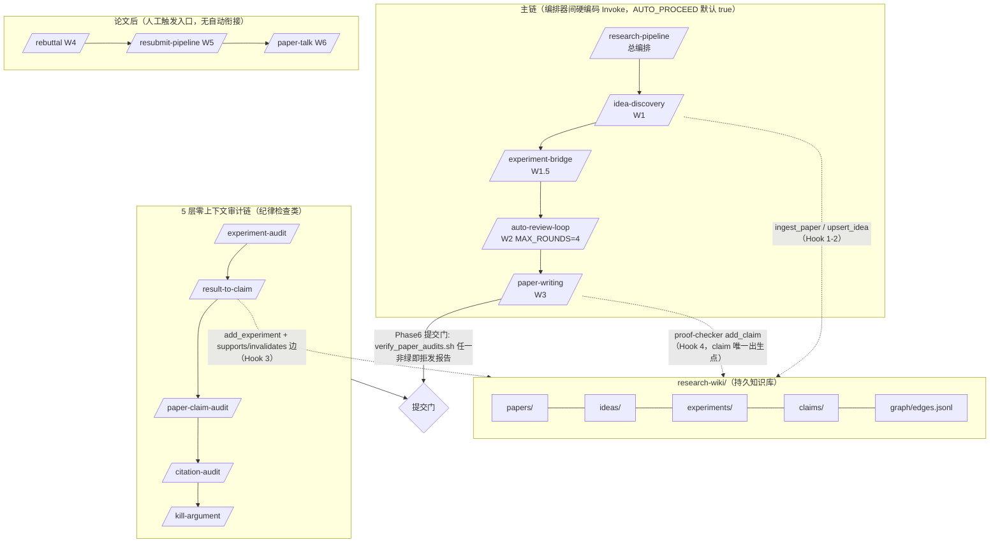

# 六仓库横向对比总报告

目的：为自建"用户控制型 Research OS"（人掌握阶段推进权、小 skill 可组合、artifact contract 清晰）选型抽素材。
方法：只读静态分析，结论均出自实际文件（各仓 REPORT.md 带行号证据），不采信 README。
日期：2026-08-28

---

## 1. 横向对比表

| 维度 | ARIS | Orchestra AI-research-SKILLs | AutoResearchClaw | EurekAgent | Archon-Horizon | karpathy/autoresearch |
|---|---|---|---|---|---|---|
| **本质形态** | 82 个 SKILL.md + tools/ 脚本 | 98 个 SKILL.md（实质 10 个） | Python runtime（8.15 万行） | LangGraph runtime（1.3 万行）+ Claude Code | Python runtime（orchestrator 1634 行） | 3 个文件（program.md 契约） |
| **workflow 覆盖率**（文献→构思→实验→分析→论文→rebuttal→沉淀） | ★★★★★ 全流程 W1–W6 + wiki | ★★★☆ 双循环框架全但浅，实验执行靠路由占位 | ★★★★★ 23 stage 全覆盖 | ★☆ 仅实验内循环 | ★☆ 仅 AI4Math 分支 | ★ 仅训练实验内循环 |
| **实质率** | ~94%（5/82 凑数或空泛） | ~10%（88 个是批量爬文档的库手册，dev_data/SCRAPING_STATUS.md 自证） | 23 stage 全有执行器，8 个实质深度，其余 prompt 壳 | 无凑数，evaluator 三件套真实 | 无凑数，宣传全部代码可考 | 无凑数 |
| **自动推进点** | ~85 处：AUTO_PROCEED 检查点 ~25（**全局默认 true**，AGENT_GUIDE.md:58）+ 12 编排器硬编码 Invoke 链 ~50 条 + 循环/定时 ~10 | 13 处，真身唯一：`/loop 20m` 定时 tick（SKILL.md:253），与研究循环显式解耦（:284） | `--auto-approve` 一键绕过 3 个 gate + PIVOT/REFINE 自动递归（上限 MAX_DECISION_PIVOTS=2） | max_loops=5 固定循环，无 improvement 阈值 | round 循环 + resume；**无**自动重试守护（退出码 3 靠外部拉起） | **NEVER STOP 无上限**（program.md L112），仅人工 interrupt |
| **人控设计** | 反差大：paper-talk/slides/patent/grant 默认人控（AUTO_PROCEED=false），主链默认全自动 | "Do not ask the user"（SKILL.md:16）与用户控制哲学正相反 | 3 个 HITL gate + attach 文件应答（session.py:217-237）是现成范本 | 循环边界清晰但内部全自动 | terminal 状态归属 agent 显式行为（orchestrator.py:931-948） | Setup 需人确认，循环内零请示 |
| **内容质量评分**（精读抽样均分） | 8.2/10（analyze-results 2/10 是唯一败笔） | 7.9/10（核心高、领域 skill 6/10 拉低） | 8.0/10（stages.py 9，runner.py 7 因幽灵依赖） | 8.5/10 | 8.8/10 | 9/10 |
| **代码强制纪律** | 部分（verify_paper_audits.sh、run_state.py 门） | 无，纯 prompt | 契约校验强制（缺输入即 FAIL） | 服务端权威写盘 + PreToolUse 钩子 | **最强**：freeze 写集门禁、read_only 引擎级强制 | 无（契约写在 git 操作绑定里） |
| **已知缺陷** | 跨模型评审强绑 mcp__codex；helper 路径解析链脆弱（有事故史） | experiments/ 目录无文件级 schema（契约缺口） | 4 处幽灵依赖（cost_tracker/event_log/experiment_spec/pitfall_detector 不存在，except 吞掉）；repro manifest 浅 | 防 reward hacking 依赖问题作者自觉 | 1634 行单文件 orchestrator | 无显著性阈值（相等即 discard） |
| **License** | MIT | MIT | MIT | AGPL-3.0 ⚠️ | Apache-2.0 | （karpathy 惯例，需查） |

---

## 2. 每仓最值得抽的 3 样东西

### ARIS（素材库首选）
1. **research-wiki 整套契约 + 767 行实现**（`tools/research_wiki.py` + `skills/research-wiki/SKILL.md`）：四类实体 + edges.jsonl 图 + query_pack 8000 字符硬预算 + 证明轴/实验轴双轨分离 + 失败 idea 永不先裁。有 pytest 背书，直接可移植。
2. **`skills/shared-references/` 31 个纪律契约**：assurance-contract（6 态 verdict）、reviewer-independence（只传路径不传解读）、acceptance-gate（"A goal can DRIVE; it cannot ACQUIT"）、external-cadence（/loop 戒律）。与具体流程解耦，零改造成本。
3. **5 层零上下文审计链**（experiment-audit / result-to-claim / paper-claim-audit / citation-audit / kill-argument + `tools/verify_paper_audits.sh`）：机器可读 JSON verdict + 决策表，天然契合"人工裁决"的用户控制模型。

### Orchestra AI-research-SKILLs（架构蓝图）
1. **双循环 + 四方向决策架构**（`0-autoresearch-skill/SKILL.md:60-242`）：Inner（协议先行 git 预注册）/ Outer（DEEPEN/BROADEN/PIVOT/CONCLUDE）——直接对应 Research OS 引擎设计。
2. **`templates/research-state.yaml`**：全六仓唯一机器可读状态 schema（含枚举值），可直接落地。
3. **`templates/research-log.md` 的 20 条示例语料**：带数字、带决策理由的 few-shot 教材，教 agent 什么叫"好日志"。

### AutoResearchClaw（stage/gate 骨架）
1. **`pipeline/stages.py`（361 行）**：stage 枚举 + 状态机 + GATE_ROLLBACK + DECISION_ROLLBACK + pivot 上限——HITL gate 骨架可直接移植。
2. **`pipeline/contracts.py` + executor 契约校验**：23 stage input/output artifact 契约表，"缺输入即 FAIL、空产物即 FAIL"的强制模式。
3. **HITL gate 闭环 + citation verify**：`hitl/session.py` 文件轮询应答（attach 模式）+ `literature/verify.py`（974 行真 API 核验，独立可拔插）。

### EurekAgent（evaluator 层）
1. **evaluator 契约**：任意 `evaluate.py` 定义 `grade_submission` + `is_better` 两函数即接入（server.py:49-67 启动校验）。极简且与 agent 框架无耦合。
2. **隔离拓扑**：hidden_eval 只读挂载进 grader 容器、agent 容器无此挂载、HTTP `/grade` 单向拿分（container.py:104）。任何 docker-compose 可复刻。
3. **防篡改组合**：服务端权威写成绩 + 提交即焚 + sha256 留痕 + trusted-record 优先（server.py:597-603, 672-681）。

### Archon-Horizon（AI4Math + 机制强制范本）
1. **`hgraph/` 纯文件语义图引擎**：自包含无外部依赖，节点一 Markdown、边一文件，`Analysis.frontier()` 可直接搬到任何 Lean 项目。
2. **fresh-context review + `subagents/compile.py`**：把 `read_only` 从 prompt 纪律编译成引擎级强制（disallowedTools / sandbox read-only）——"纪律落地为机制"的范本，六仓独有。
3. **checkpoint/continue 设计**：编号 runlog + `_resume_point` + paused.json + 退出码 3（抄设计不抄码，与 task_store 耦合）。

### karpathy/autoresearch（实验内循环契约）
1. **`program.md` 全文（9/10）**：CAN/CANNOT 权限边界、keep/discard ↔ git advance/reset 绑定、NEVER STOP 反请示条款、crash/timeout 熔断——experiment-run skill 的现成模板。
2. **固定评估锚点模式**：`evaluate_bpb` 标注 "DO NOT CHANGE — this is the fixed metric"，固定 val shard 保证跨实验可比。
3. **results.tsv 机读日志 schema**：五列含 crash 编码约定（val_bpb=0.000000），零解析歧义。

---

## 3. 移植 vs 自写建议

**结论：抽资产自写，不移植任何 runtime。**

- **六个 runtime 都不符合"用户控制"哲学**：ARIS 全局 AUTO_PROCEED=true + 50 条硬编码 Invoke 链；Orchestra "Do not ask the user"；AutoResearchClaw `--auto-approve` + 自动递归 pivot；EurekAgent/Archon-Horizon 是自成体系的 runtime（且 EurekAgent 是 AGPL，移植有传染性风险）；autoresearch NEVER STOP。改造任何一个都比自写贵。
- **但六仓的"文本资产"与"机制设计"价值极高**，且都以文件形态存在（SKILL.md / 契约 yaml / 状态机表），抽取成本低：
  - skill 内容 → 从 ARIS 抽（82 个里挑 20 个核心，砍掉 AUTO_PROCEED 与硬编码 Invoke 链，改为"输出下一步建议后停止"）；
  - 状态 schema → 从 Orchestra 抽 research-state.yaml；
  - gate 状态机 → 从 AutoResearchClaw 抽 stages.py 的表（GATE_ROLLBACK / MAX_DECISION_PIVOTS 思路，重写成纯数据）；
  - evaluator 契约 → 抄 EurekAgent 两函数契约 + 不对称挂载拓扑（注意 AGPL，只抄设计）；
  - 机制强制纪律 → 抄 Archon-Horizon compile.py 思路（read_only → disallowedTools）；
  - 实验循环纪律 → 抄 program.md，把 NEVER STOP 改成"完成预算后停止并汇报"。
- **唯一可考虑直接依赖的代码**：Archon-Horizon 的 `hgraph/`（自包含、Apache-2.0），用于 AI4Math 分支的 lemma DAG。
- **优先级**（对应 handoff 的 P0 vertical slice）：先抽 ARIS 的 experiment-plan/run-experiment/paper-claim-audit 三个 skill 内容 + Orchestra 的 state schema + program.md 的循环纪律，拼出 `experiment-plan → experiment-run → experiment-analyze → research-reflect` 最小闭环。

---

## 4. ARIS 全景图（W 链 + 审计链 + wiki 分层）

（W1–W6 各链的细粒度 DAG 与全部边出处见 `ARIS/REPORT.md` §3；Mermaid 已足够表达，未另行产出 HTML。）

---

## 5. 报告文件清单

| 文件 | 行数 |
|---|---|
| `analysis/ARIS/REPORT.md` | 582 |
| `analysis/AI-research-SKILLs/REPORT.md` | 256 |
| `analysis/AutoResearchClaw/REPORT.md` | 184 |
| `analysis/EurekAgent/REPORT.md` | 110 |
| `analysis/Archon-Horizon/REPORT.md` | 179 |
| `analysis/autoresearch/REPORT.md` | 111 |
| `analysis/COMPARISON.md` | 本文件 |

## 6. 六仓库一句话评分

| 仓库 | 评分 |
|---|---|
| **ARIS** | 9/10——素材密度最高：wiki 契约、审计链、shared-references 全是干货；唯需砍掉默认全自动的骨架 |
| **Archon-Horizon** | 8.5/10——纪律由代码强制（freeze/read_only/状态归属），六仓中最硬核的工程实现，但只服务 AI4Math |
| **autoresearch** | 9/10——最小集最高完成度，program.md 是实验循环契约的教科书；NEVER STOP 是唯一要改的 |
| **EurekAgent** | 8/10——evaluator 隔离与防篡改是真实现，AGPL 与 Claude Code 耦合限制移植方式（只抄设计） |
| **AutoResearchClaw** | 7/10——stage/gate 骨架与契约表有价值，但 4 处幽灵依赖暴露工程质量，runner 不可直接信 |
| **Orchestra** | 6.5/10——0-autoresearch-skill 的双循环与 state schema 是真好东西，但 88 个领域 skill 是批量爬文档的注水 |
